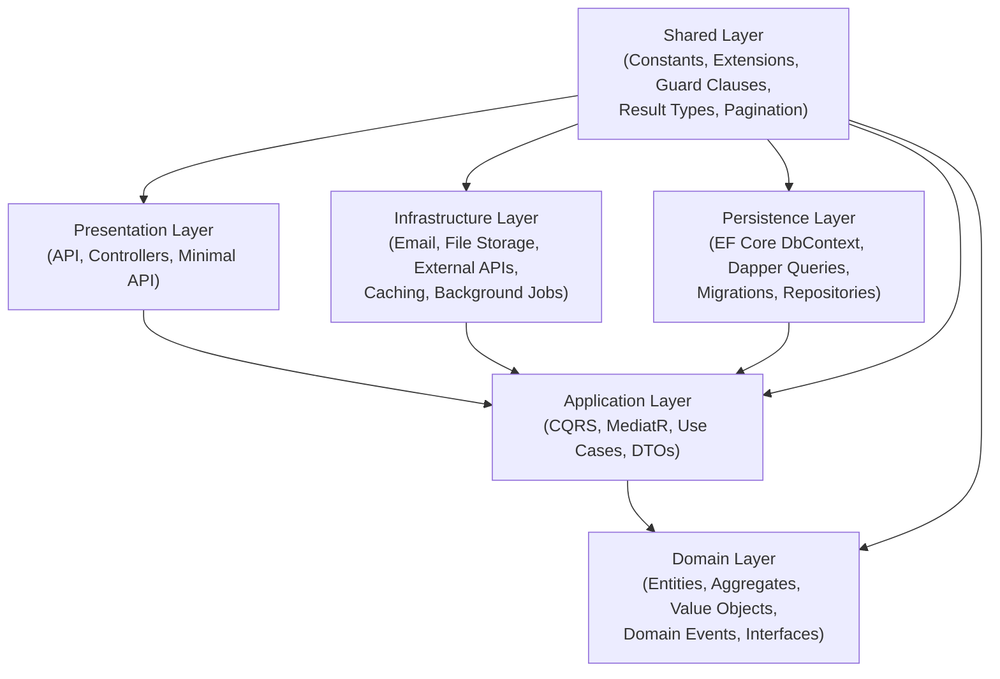
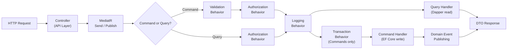
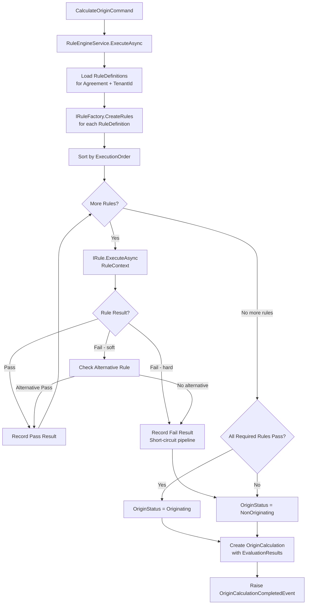
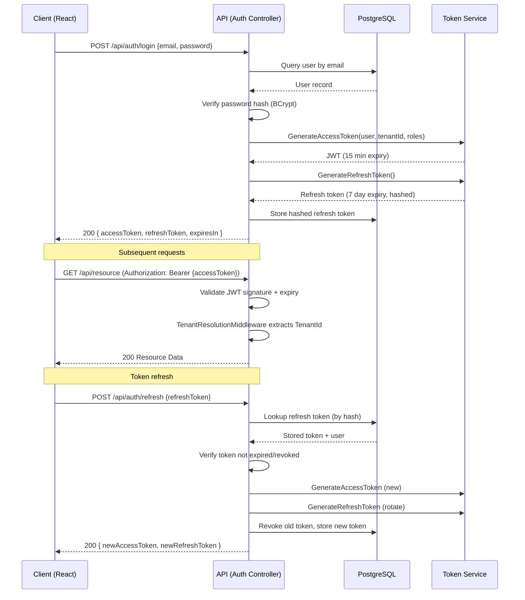

# Architecture Handbook — Preferential Rules of Origin Calculation System

> Version: 1.0 | Last Updated: 2026-06-26 | Classification: Internal Engineering Reference

---

## Table of Contents

1. [Vision](#1-vision)
2. [Architectural Principles](#2-architectural-principles)
3. [Clean Architecture](#3-clean-architecture)
4. [Folder Structure](#4-folder-structure)
5. [Feature Organization](#5-feature-organization)
6. [Domain Driven Design](#6-domain-driven-design)
7. [Multi-Tenancy Architecture](#7-multi-tenancy-architecture)
8. [Localization Architecture](#8-localization-architecture)
9. [CQRS / MediatR](#9-cqrs--mediatr)
10. [Read Model (Dapper) vs Write Model (EF Core)](#10-read-model-dapper-vs-write-model-ef-core)
11. [Repository Pattern](#11-repository-pattern)
12. [Generic Rule Engine Architecture](#12-generic-rule-engine-architecture)
13. [Middleware Pipeline](#13-middleware-pipeline)
14. [Authentication Flow](#14-authentication-flow)
15. [Authorization Flow](#15-authorization-flow)
16. [Configuration Management](#16-configuration-management)
17. [Logging](#17-logging)
18. [Exception Handling](#18-exception-handling)
19. [Audit Trail](#19-audit-trail)
20. [Background Services](#20-background-services)
21. [File Upload Architecture](#21-file-upload-architecture)
22. [Reporting](#22-reporting)
23. [Caching](#23-caching)
24. [Docker](#24-docker)
25. [CI/CD](#25-cicd)
26. [AI Agent Rules](#26-ai-agent-rules)

---

## 1. Vision

### Why This System Exists

The Preferential Rules of Origin (PRoO) Calculation System exists to automate and enforce the origin determination process required under EU Free Trade Agreements (FTAs). Determining whether a product qualifies for preferential tariff rates under an FTA is a legally complex, multi-step process governed by the EU's Generalised Scheme of Preferences (GSP), EU–UK Trade and Cooperation Agreement, and bilateral FTAs covering over 70 trade partner countries.

Before this system, origin calculations were performed manually by trade compliance officers using spreadsheets and paper-based rule lookups. This approach created three critical problems:

- **Legal exposure**: Manual errors in origin determination expose importers and exporters to retroactive duty assessments, fines, and loss of preferential status.
- **Operational inefficiency**: Each HS code lookup against treaty rules could take 30–90 minutes per product line per agreement.
- **Audit gap**: Without a structured audit trail, it was impossible to demonstrate compliance to customs authorities during post-clearance audits.

### Regulatory Context

Rules of Origin under EU trade agreements are defined in:

- **Protocol 1** of each bilateral FTA (e.g., EU–Korea, EU–Canada CETA, EU–Japan EPA)
- **Annex 22-03** of the Union Customs Code Delegated Regulation (UCC DA)
- **REX Regulation** (EU) 2015/2447 for registered exporters

The core question answered by the system: _Does this finished product, manufactured using a combination of originating and non-originating materials, qualify as originating in the country of production under the applicable trade agreement?_

Three fundamental rules govern origin qualification:

1. **Wholly Obtained (WO)**: The product is entirely produced in one country.
2. **Sufficient Processing (SP)**: The product undergoes enough transformation, typically measured by Tariff Shift (TS), Value Added (VA) threshold, or a combination.
3. **Minimal Operations**: Certain operations are always insufficient, regardless of processing level.

### EU Trade Agreement Scope

The system is designed to handle the full complexity of EU trade agreements including:

- Bilateral and multilateral agreements
- Cumulation provisions (bilateral, diagonal, full)
- Tolerance (de minimis) rules
- Duty drawback restrictions
- Proof of origin requirements (EUR.1, EUR-MED, Statement on Origin, REX)
- Period of validity rules for proofs
- Verification and administrative cooperation clauses

---

## 2. Architectural Principles

The following principles govern every architectural and implementation decision in this system. Deviations must be reviewed by the architecture lead and documented with explicit justification.

### Principle 1: Domain Centrality

The domain model is the heart of the application. Business rules live in the domain layer and nowhere else. No business logic is permitted in controllers, request handlers that duplicate domain logic, or database procedures.

**Rationale**: Trade rules change when agreements are renegotiated. Keeping rules in the domain makes them discoverable, testable, and changeable without touching infrastructure.

### Principle 2: Dependency Inversion at Layer Boundaries

Higher-level layers define abstractions (interfaces). Lower-level layers implement them. The domain layer has zero dependencies on any other project. Infrastructure depends on Application; Application depends on Domain.

**Rationale**: This makes the system testable in isolation. The entire business logic can be unit tested without a database or HTTP server.

### Principle 3: Explicit Over Implicit

Configuration, validation, and behavior must be explicit. Magic strings, implicit conventions without documentation, and "convention over configuration" patterns must be avoided unless the convention is comprehensively documented in this handbook.

**Rationale**: Trade compliance software is audited. Auditors and regulators need to trace behavior to explicit configuration.

### Principle 4: Command Query Responsibility Segregation (CQRS)

Every operation is either a Command (writes state, returns minimal result) or a Query (reads state, returns data, makes no changes). Mixed operations are prohibited.

**Rationale**: Read and write workloads have different scaling, consistency, and performance requirements. Separating them allows each to evolve independently.

### Principle 5: Fail Loud, Recover Gracefully

Exceptions are exceptional. Domain validation produces Results, not exceptions. Infrastructure failures (database unavailable, external API timeout) produce structured error responses. Exceptions that escape to the middleware layer are logged with full context and returned as standard ProblemDetails envelopes.

**Rationale**: Customs authorities examine system logs during audits. Every error must have a traceable correlation ID.

### Principle 6: Multi-Tenancy by Design

Every entity that carries business data must have a TenantId. Every query must filter by tenant. No cross-tenant data leakage is acceptable under any circumstance.

**Rationale**: The system is operated as a SaaS product used by multiple customs brokers and manufacturers. Data isolation is a legal and contractual obligation.

### Principle 7: Audit Everything

Every create, update, and delete operation on any entity must produce an immutable audit record. Audit records capture who, what, when, from where (IP/machine), and what changed.

**Rationale**: EU customs authorities can audit origin declarations up to three years after export. The system must be able to reconstruct the state of any rule or calculation at any past point in time.

### Principle 8: Security by Default

Authentication is required for all endpoints except health checks. Authorization is enforced at the application layer (MediatR pipeline), not just at the API layer. Sensitive data is never logged. Secrets are never in source control.

**Rationale**: The system contains commercially sensitive supply chain and pricing data. A breach could expose business-critical information to competitors.

### Principle 9: Vertical Slice Feature Organization

Features are organized as vertical slices through the application stack, not horizontal layers per feature type. Each feature folder contains its commands, queries, validators, DTOs, and event handlers.

**Rationale**: Features change together. Grouping by feature minimizes the number of files touched when a feature is modified.

### Principle 10: Testability as a First-Class Requirement

Every non-trivial piece of logic must be unit testable without mocking infrastructure. Integration tests cover the full stack against a real PostgreSQL instance. End-to-end tests cover critical user journeys. Code coverage for domain and application layers must exceed 80%.

**Rationale**: Incorrectly implemented rules have legal consequences. Automated testing is the first line of defence against rule regression.

---

## 3. Clean Architecture

### Layer Diagram



### Dependency Rules

| From Layer | May Depend On | Must NOT Depend On |
|---|---|---|
| Domain | Shared only | Application, Infrastructure, Persistence, API |
| Application | Domain, Shared | Infrastructure, Persistence, API |
| Infrastructure | Application, Domain, Shared | Persistence, API |
| Persistence | Application, Domain, Shared | Infrastructure, API |
| API | Application, Shared | Domain (directly), Infrastructure, Persistence |
| Shared | Nothing | Any other project |

### What Belongs Where

**Domain Layer** — Pure C# with no NuGet dependencies except abstractions:
- Entity base classes and aggregate roots
- Value objects
- Domain events
- Repository interfaces (contracts only, no implementation)
- Domain service interfaces
- Enumeration classes
- Domain exceptions
- Business rule methods on entities

**Application Layer** — Orchestration and use case logic:
- MediatR Command and Query handlers
- FluentValidation validators
- AutoMapper profiles
- Application service interfaces
- DTOs (Data Transfer Objects)
- Application-level exceptions
- Behavior pipeline classes (logging, validation, authorization behaviors)

**Infrastructure Layer** — External world integration:
- Email service implementation (SMTP, SendGrid)
- File storage implementation (Azure Blob, local disk)
- External tariff API clients
- Background job scheduling (Hangfire)
- Cache provider wrappers
- Identity provider integration

**Persistence Layer** — Data access:
- EF Core `DbContext` and entity configurations
- EF Core migrations
- Repository implementations
- Dapper query objects
- Database seeders
- Connection factory

**API Layer** — HTTP boundary:
- Controllers or Minimal API endpoint groups
- Request/response models (separate from application DTOs where needed)
- Swagger/OpenAPI configuration
- Middleware registrations
- Dependency injection wiring (`Program.cs`, extension methods)
- API-specific filters

---

## 4. Folder Structure

```
PraeferenzRoO.sln
│
├── src/
│   ├── Api/
│   │   ├── Controllers/
│   │   │   ├── AuthController.cs
│   │   │   ├── TradeAgreementController.cs
│   │   │   ├── HSCodeController.cs
│   │   │   ├── ProductRuleController.cs
│   │   │   ├── OriginCalculationController.cs
│   │   │   ├── ReportController.cs
│   │   │   └── AdminController.cs
│   │   ├── Middleware/
│   │   │   ├── ExceptionHandlingMiddleware.cs
│   │   │   ├── TenantResolutionMiddleware.cs
│   │   │   ├── CorrelationIdMiddleware.cs
│   │   │   └── RequestLoggingMiddleware.cs
│   │   ├── Extensions/
│   │   │   ├── ServiceCollectionExtensions.cs
│   │   │   ├── WebApplicationExtensions.cs
│   │   │   └── SwaggerExtensions.cs
│   │   ├── Filters/
│   │   │   └── ApiExceptionFilter.cs
│   │   ├── appsettings.json
│   │   ├── appsettings.Development.json
│   │   ├── appsettings.Production.json
│   │   └── Program.cs
│   │
│   ├── Application/
│   │   ├── Common/
│   │   │   ├── Behaviors/
│   │   │   │   ├── LoggingBehavior.cs
│   │   │   │   ├── ValidationBehavior.cs
│   │   │   │   ├── AuthorizationBehavior.cs
│   │   │   │   ├── PerformanceBehavior.cs
│   │   │   │   └── TransactionBehavior.cs
│   │   │   ├── Interfaces/
│   │   │   │   ├── ICurrentUserService.cs
│   │   │   │   ├── ITenantService.cs
│   │   │   │   ├── IDateTimeService.cs
│   │   │   │   ├── IEmailService.cs
│   │   │   │   └── IFileStorageService.cs
│   │   │   ├── Models/
│   │   │   │   ├── Result.cs
│   │   │   │   ├── PagedResult.cs
│   │   │   │   └── ApiResponse.cs
│   │   │   └── Mappings/
│   │   │       └── MappingProfile.cs
│   │   ├── Features/
│   │   │   ├── TradeAgreements/
│   │   │   │   ├── Commands/
│   │   │   │   ├── Queries/
│   │   │   │   ├── DTOs/
│   │   │   │   └── Validators/
│   │   │   ├── HSCodes/
│   │   │   ├── ProductRules/
│   │   │   ├── OriginCalculations/
│   │   │   ├── Materials/
│   │   │   ├── FinishedProducts/
│   │   │   ├── RuleDefinitions/
│   │   │   ├── Countries/
│   │   │   └── Auth/
│   │   └── DependencyInjection.cs
│   │
│   ├── Domain/
│   │   ├── Aggregates/
│   │   │   ├── TradeAgreement/
│   │   │   │   ├── TradeAgreement.cs
│   │   │   │   ├── TradeAgreementStatus.cs
│   │   │   │   └── Events/
│   │   │   ├── Country/
│   │   │   ├── HSCode/
│   │   │   ├── ProductRule/
│   │   │   ├── Material/
│   │   │   ├── FinishedProduct/
│   │   │   ├── OriginCalculation/
│   │   │   └── RuleDefinition/
│   │   ├── Common/
│   │   │   ├── BaseEntity.cs
│   │   │   ├── AuditableEntity.cs
│   │   │   ├── AggregateRoot.cs
│   │   │   ├── ValueObject.cs
│   │   │   └── DomainEvent.cs
│   │   ├── Enumerations/
│   │   │   ├── RuleType.cs
│   │   │   ├── OriginStatus.cs
│   │   │   └── AgreementType.cs
│   │   ├── Interfaces/
│   │   │   ├── IRepository.cs
│   │   │   ├── IUnitOfWork.cs
│   │   │   ├── ITradeAgreementRepository.cs
│   │   │   └── IOriginCalculationRepository.cs
│   │   ├── Events/
│   │   │   ├── OriginCalculationCompletedEvent.cs
│   │   │   └── RuleDefinitionUpdatedEvent.cs
│   │   └── ValueObjects/
│   │       ├── HSCodeValue.cs
│   │       ├── CountryCode.cs
│   │       ├── ValueThreshold.cs
│   │       └── TariffShiftRule.cs
│   │
│   ├── Infrastructure/
│   │   ├── Services/
│   │   │   ├── CurrentUserService.cs
│   │   │   ├── TenantService.cs
│   │   │   ├── DateTimeService.cs
│   │   │   ├── EmailService.cs
│   │   │   └── FileStorageService.cs
│   │   ├── ExternalApis/
│   │   │   ├── TariffApiClient.cs
│   │   │   └── HSCodeValidationClient.cs
│   │   ├── BackgroundJobs/
│   │   │   ├── RuleSetSyncJob.cs
│   │   │   └── AuditCleanupJob.cs
│   │   ├── Caching/
│   │   │   ├── CacheService.cs
│   │   │   └── CacheKeys.cs
│   │   └── DependencyInjection.cs
│   │
│   ├── Persistence/
│   │   ├── Context/
│   │   │   ├── ApplicationDbContext.cs
│   │   │   └── ReadDbContext.cs
│   │   ├── Configurations/
│   │   │   ├── TradeAgreementConfiguration.cs
│   │   │   ├── HSCodeConfiguration.cs
│   │   │   ├── ProductRuleConfiguration.cs
│   │   │   ├── OriginCalculationConfiguration.cs
│   │   │   └── AuditLogConfiguration.cs
│   │   ├── Repositories/
│   │   │   ├── GenericRepository.cs
│   │   │   ├── TradeAgreementRepository.cs
│   │   │   └── OriginCalculationRepository.cs
│   │   ├── Queries/
│   │   │   ├── TradeAgreementQueries.cs
│   │   │   ├── OriginCalculationQueries.cs
│   │   │   └── ReportQueries.cs
│   │   ├── Migrations/
│   │   ├── Interceptors/
│   │   │   ├── AuditableEntityInterceptor.cs
│   │   │   └── TenantFilterInterceptor.cs
│   │   ├── Seeders/
│   │   │   ├── DatabaseSeeder.cs
│   │   │   └── CountrySeeder.cs
│   │   └── DependencyInjection.cs
│   │
│   └── Shared/
│       ├── Constants/
│       │   ├── AppConstants.cs
│       │   ├── RoleConstants.cs
│       │   └── CacheKeys.cs
│       ├── Extensions/
│       │   ├── StringExtensions.cs
│       │   ├── QueryableExtensions.cs
│       │   └── DateTimeExtensions.cs
│       ├── Guards/
│       │   └── Guard.cs
│       ├── Pagination/
│       │   ├── PagedList.cs
│       │   └── PaginationParameters.cs
│       └── Results/
│           ├── Result.cs
│           └── Error.cs
│
└── Tests/
    ├── Domain.Tests/
    │   ├── Aggregates/
    │   └── ValueObjects/
    ├── Application.Tests/
    │   ├── Features/
    │   └── Behaviors/
    ├── Infrastructure.Tests/
    ├── Persistence.Tests/
    │   └── Repositories/
    └── Api.Tests/
        ├── Controllers/
        └── Integration/
```

---

## 5. Feature Organization

The Application layer is organized as **vertical slices**. Each feature is self-contained in its own folder under `Application/Features/`. This means a developer working on TradeAgreements touches only the `TradeAgreements/` folder.

### Slice Structure

```
Application/Features/OriginCalculations/
├── Commands/
│   ├── CalculateOrigin/
│   │   ├── CalculateOriginCommand.cs
│   │   ├── CalculateOriginCommandHandler.cs
│   │   └── CalculateOriginCommandValidator.cs
│   └── UpdateCalculation/
│       ├── UpdateCalculationCommand.cs
│       ├── UpdateCalculationCommandHandler.cs
│       └── UpdateCalculationCommandValidator.cs
├── Queries/
│   ├── GetCalculationById/
│   │   ├── GetCalculationByIdQuery.cs
│   │   ├── GetCalculationByIdQueryHandler.cs
│   │   └── CalculationDetailDto.cs
│   └── GetCalculationHistory/
│       ├── GetCalculationHistoryQuery.cs
│       ├── GetCalculationHistoryQueryHandler.cs
│       └── CalculationHistorySummaryDto.cs
├── DTOs/
│   ├── CalculationResultDto.cs
│   ├── MaterialInputDto.cs
│   └── RuleEvaluationDto.cs
└── EventHandlers/
    └── OriginCalculationCompletedEventHandler.cs
```

### Naming Conventions

| Artifact | Pattern | Example |
|---|---|---|
| Command | `{Verb}{Entity}Command` | `CalculateOriginCommand` |
| Command Handler | `{Verb}{Entity}CommandHandler` | `CalculateOriginCommandHandler` |
| Query | `Get{Entity}By{Property}Query` | `GetTradeAgreementByCodeQuery` |
| Query Handler | `Get{Entity}By{Property}QueryHandler` | `GetTradeAgreementByCodeQueryHandler` |
| Validator | matches its command/query name + `Validator` | `CalculateOriginCommandValidator` |
| DTO (list) | `{Entity}SummaryDto` | `TradeAgreementSummaryDto` |
| DTO (detail) | `{Entity}DetailDto` | `TradeAgreementDetailDto` |
| Event Handler | `{Event}Handler` | `OriginCalculationCompletedEventHandler` |

---

## 6. Domain Driven Design

### Core Building Blocks

**Entity**: Has identity. Two entities with the same identity are equal regardless of other property values.

```csharp
public abstract class BaseEntity
{
    public Guid Id { get; protected set; } = Guid.NewGuid();
    public override bool Equals(object? obj)
        => obj is BaseEntity other && Id == other.Id;
    public override int GetHashCode() => Id.GetHashCode();
}
```

**Value Object**: Has no identity. Two value objects with the same properties are equal.

```csharp
public class HSCodeValue : ValueObject
{
    public string Code { get; }
    public int Chapter => int.Parse(Code[..2]);
    public int Heading => int.Parse(Code[..4]);

    public HSCodeValue(string code)
    {
        if (!System.Text.RegularExpressions.Regex.IsMatch(code, @"^\d{6,10}$"))
            throw new DomainException($"Invalid HS Code format: {code}");
        Code = code;
    }

    protected override IEnumerable<object> GetEqualityComponents()
    {
        yield return Code;
    }
}
```

**Aggregate Root**: Entry point for all operations on the aggregate. Ensures invariants are maintained.

```csharp
public abstract class AggregateRoot : AuditableEntity
{
    private readonly List<DomainEvent> _domainEvents = new();
    public IReadOnlyCollection<DomainEvent> DomainEvents => _domainEvents.AsReadOnly();

    protected void AddDomainEvent(DomainEvent domainEvent) => _domainEvents.Add(domainEvent);
    public void ClearDomainEvents() => _domainEvents.Clear();
}
```

**Domain Event**: Signals that something significant happened in the domain.

```csharp
public abstract record DomainEvent
{
    public Guid EventId { get; } = Guid.NewGuid();
    public DateTime OccurredOn { get; } = DateTime.UtcNow;
}

public record OriginCalculationCompletedEvent(
    Guid CalculationId,
    Guid TenantId,
    string OriginStatus,
    string HSCode) : DomainEvent;
```

### The 8 Domain Aggregates

#### 1. TradeAgreement

Represents an EU Free Trade Agreement with a partner country or bloc. Contains the effective dates, cumulation provisions, and tolerance rules applicable to the agreement.

```csharp
public class TradeAgreement : AggregateRoot
{
    public string AgreementCode { get; private set; }
    public string Name { get; private set; }
    public CountryCode PartnerCountry { get; private set; }
    public DateTime EffectiveFrom { get; private set; }
    public DateTime? EffectiveTo { get; private set; }
    public CumulationType CumulationType { get; private set; }
    public decimal TolerancePercentage { get; private set; }
    public bool DutyDrawbackRestriction { get; private set; }
    public Guid TenantId { get; private set; }
    private readonly List<ProductRule> _productRules = new();
    public IReadOnlyCollection<ProductRule> ProductRules => _productRules.AsReadOnly();

    public void AddProductRule(ProductRule rule)
    {
        if (_productRules.Any(r => r.HSCode == rule.HSCode))
            throw new DomainException($"Rule for HS Code {rule.HSCode} already exists in this agreement.");
        _productRules.Add(rule);
        AddDomainEvent(new ProductRuleAddedEvent(Id, rule.Id));
    }
}
```

#### 2. Country

Represents a country or customs territory. Holds ISO codes, EU membership status, and GSP beneficiary status.

```csharp
public class Country : AggregateRoot
{
    public CountryCode IsoAlpha2 { get; private set; }
    public string IsoAlpha3 { get; private set; }
    public string Name { get; private set; }
    public bool IsEuMember { get; private set; }
    public bool IsGspBeneficiary { get; private set; }
    public string? GspTier { get; private set; }
    public Guid TenantId { get; private set; }
}
```

#### 3. HSCode

Represents a Harmonized System tariff classification code. The HS Code is the universal product classification used in all trade agreements.

```csharp
public class HSCode : AggregateRoot
{
    public HSCodeValue Code { get; private set; }
    public int Chapter => Code.Chapter;
    public int Heading => Code.Heading;
    public string Description { get; private set; }
    public string DescriptionDe { get; private set; }
    public string? DescriptionFr { get; private set; }
    public bool IsActive { get; private set; }
    public Guid TenantId { get; private set; }
}
```

#### 4. ProductRule

Represents the specific rule of origin applicable to a product (identified by HS Code) under a given trade agreement. Contains the rule type (tariff shift, value added, specific process) and its parameters.

```csharp
public class ProductRule : AggregateRoot
{
    public Guid TradeAgreementId { get; private set; }
    public HSCodeValue HSCode { get; private set; }
    public RuleType RuleType { get; private set; }
    public TariffShiftRule? TariffShiftRule { get; private set; }
    public ValueThreshold? ValueAddedThreshold { get; private set; }
    public string? SpecificProcessDescription { get; private set; }
    public bool AlternativeRuleAllowed { get; private set; }
    public ProductRule? AlternativeRule { get; private set; }
    public Guid TenantId { get; private set; }

    public bool IsSatisfiedBy(RuleContext context) =>
        RuleType switch
        {
            RuleType.TariffShift => TariffShiftRule!.IsSatisfiedBy(context),
            RuleType.ValueAdded => ValueAddedThreshold!.IsSatisfiedBy(context),
            RuleType.SpecificProcess => context.ProcessesDeclared.Contains(SpecificProcessDescription!),
            RuleType.Combined => TariffShiftRule!.IsSatisfiedBy(context) && ValueAddedThreshold!.IsSatisfiedBy(context),
            _ => false
        };
}
```

#### 5. Material

Represents a raw material or component used in the production of a finished product. Tracks origin status, HS Code, and value percentage.

```csharp
public class Material : AggregateRoot
{
    public string Name { get; private set; }
    public HSCodeValue HSCode { get; private set; }
    public CountryCode CountryOfOrigin { get; private set; }
    public bool IsOriginating { get; private set; }
    public decimal ValuePercentage { get; private set; }
    public decimal Weight { get; private set; }
    public string UnitOfMeasure { get; private set; }
    public Guid TenantId { get; private set; }
}
```

#### 6. FinishedProduct

Represents the manufactured product whose origin is to be determined. Contains the BOM (Bill of Materials) linking to Material records.

```csharp
public class FinishedProduct : AggregateRoot
{
    public string ProductCode { get; private set; }
    public string Description { get; private set; }
    public HSCodeValue HSCode { get; private set; }
    public CountryCode CountryOfManufacture { get; private set; }
    public decimal ExWorks Price { get; private set; }
    private readonly List<Material> _materials = new();
    public IReadOnlyCollection<Material> Materials => _materials.AsReadOnly();
    public Guid TenantId { get; private set; }

    public decimal NonOriginatingMaterialsValue =>
        _materials.Where(m => !m.IsOriginating).Sum(m => m.ValuePercentage);
}
```

#### 7. OriginCalculation

The central calculation record. Records the inputs, the rules evaluated, and the final determination. This is the audit-critical aggregate.

```csharp
public class OriginCalculation : AggregateRoot
{
    public Guid FinishedProductId { get; private set; }
    public Guid TradeAgreementId { get; private set; }
    public OriginStatus Status { get; private set; }
    public string? FailureReason { get; private set; }
    public DateTime CalculatedAt { get; private set; }
    public string CalculatedByUserId { get; private set; }
    private readonly List<RuleEvaluationResult> _evaluationResults = new();
    public IReadOnlyCollection<RuleEvaluationResult> EvaluationResults => _evaluationResults.AsReadOnly();
    public Guid TenantId { get; private set; }

    public void Complete(OriginStatus status, IEnumerable<RuleEvaluationResult> results)
    {
        Status = status;
        _evaluationResults.AddRange(results);
        AddDomainEvent(new OriginCalculationCompletedEvent(Id, TenantId, status.ToString(), FinishedProductId.ToString()));
    }
}
```

#### 8. RuleDefinition

The configuration record for a specific rule type. Enables the rule engine to be configured without code changes. Each RuleDefinition maps to a concrete rule implementation via the Rule Engine factory.

```csharp
public class RuleDefinition : AggregateRoot
{
    public string RuleName { get; private set; }
    public string RuleType { get; private set; }
    public string ImplementingClass { get; private set; }
    public string ParametersJson { get; private set; }
    public int ExecutionOrder { get; private set; }
    public bool IsActive { get; private set; }
    public Guid TenantId { get; private set; }

    public T GetParameters<T>() =>
        System.Text.Json.JsonSerializer.Deserialize<T>(ParametersJson)
        ?? throw new DomainException($"Cannot deserialize parameters for rule {RuleName}");
}
```

---

## 7. Multi-Tenancy Architecture

### Tenant Isolation Strategy

The system uses a **shared database, shared schema** strategy with row-level tenant isolation. Every business entity table includes a `TenantId` (UUID/GUID) column. Tenant isolation is enforced at three levels:

1. **Database level**: PostgreSQL row-level security (RLS) policies are applied as a secondary safety net.
2. **Application level**: EF Core global query filters automatically append `WHERE tenant_id = @tenantId` to every query.
3. **API level**: The `TenantResolutionMiddleware` validates and sets the current tenant from the JWT claim before any request processing.

### Tenant Resolution

```csharp
public class TenantResolutionMiddleware
{
    private readonly RequestDelegate _next;

    public async Task InvokeAsync(HttpContext context, ITenantService tenantService)
    {
        var tenantId = context.User.FindFirst("tenant_id")?.Value;
        if (tenantId == null || !Guid.TryParse(tenantId, out var tenantGuid))
        {
            context.Response.StatusCode = 401;
            return;
        }
        tenantService.SetCurrentTenant(tenantGuid);
        await _next(context);
    }
}
```

### EF Core Global Query Filters

```csharp
// In ApplicationDbContext.OnModelCreating
builder.Entity<TradeAgreement>()
    .HasQueryFilter(e => e.TenantId == _tenantService.CurrentTenantId);
```

### Per-Tenant Rule Sets

Each tenant may configure custom rule sets layered on top of the standard EU treaty rules. The resolution priority is:

1. **Tenant-specific override** — If a `RuleDefinition` exists with the current `TenantId` for the given HS Code and Agreement, use it.
2. **Standard treaty rule** — Fall back to the shared `ProductRule` records associated with the `TradeAgreement`.
3. **Default denial** — If no rule is found, the product is deemed non-originating.

This allows tenants with special customs arrangements or sector-specific delegated acts to configure custom rules without affecting other tenants.

---

## 8. Localization Architecture

### i18n Approach

The system supports UI localization and domain data localization as separate concerns.

**UI Localization** (labels, messages, validation errors): Implemented using ASP.NET Core's `IStringLocalizer<T>` with `.resx` resource files per feature area.

**Domain Data Localization** (HS Code descriptions, country names, agreement names): Stored as parallel columns in the database (e.g., `Description`, `DescriptionDe`, `DescriptionFr`) and resolved at the application layer based on the `Accept-Language` header.

### Supported Languages

| Code | Language | Status |
|---|---|---|
| en | English | Full support (primary) |
| de | German | Full support |
| fr | French | Partial (domain data only) |
| nl | Dutch | Planned |
| pl | Polish | Planned |

### Resource File Structure

```
Api/Resources/
├── SharedResources.resx          (default English)
├── SharedResources.de.resx
├── SharedResources.fr.resx
├── Features/
│   ├── OriginCalculations.resx
│   ├── OriginCalculations.de.resx
│   └── TradeAgreements.resx
```

### Middleware Configuration

```csharp
app.UseRequestLocalization(options =>
{
    var supported = new[] { "en", "de", "fr" };
    options.SetDefaultCulture("en")
           .AddSupportedCultures(supported)
           .AddSupportedUICultures(supported);
    options.RequestCultureProviders.Insert(0, new AcceptLanguageHeaderRequestCultureProvider());
});
```

### Frontend Localization

The React frontend uses `react-i18next` with JSON translation files. Translation keys are namespaced by feature. The active locale is stored in the user's profile and applied on login.

---

## 9. CQRS / MediatR

### CQRS Pipeline



### Command Handler Convention

All command handlers follow this pattern:

```csharp
public class CalculateOriginCommandHandler : IRequestHandler<CalculateOriginCommand, Result<CalculationResultDto>>
{
    private readonly IOriginCalculationRepository _repository;
    private readonly IUnitOfWork _unitOfWork;
    private readonly IRuleEngineService _ruleEngine;
    private readonly IMapper _mapper;

    public async Task<Result<CalculationResultDto>> Handle(
        CalculateOriginCommand request,
        CancellationToken cancellationToken)
    {
        var product = await _repository.GetFinishedProductAsync(request.FinishedProductId, cancellationToken);
        if (product is null)
            return Result<CalculationResultDto>.Failure(Error.NotFound("Product not found"));

        var calculation = await _ruleEngine.ExecuteAsync(product, request.TradeAgreementId, cancellationToken);
        await _repository.AddAsync(calculation, cancellationToken);
        await _unitOfWork.SaveChangesAsync(cancellationToken);

        return Result<CalculationResultDto>.Success(_mapper.Map<CalculationResultDto>(calculation));
    }
}
```

### Query Handler Convention

All query handlers use Dapper for read operations:

```csharp
public class GetCalculationByIdQueryHandler : IRequestHandler<GetCalculationByIdQuery, Result<CalculationDetailDto>>
{
    private readonly IDbConnectionFactory _connectionFactory;

    public async Task<Result<CalculationDetailDto>> Handle(
        GetCalculationByIdQuery request,
        CancellationToken cancellationToken)
    {
        using var connection = _connectionFactory.CreateConnection();
        const string sql = """
            SELECT c.id, c.status, c.calculated_at, c.calculated_by_user_id,
                   p.product_code, p.description, a.agreement_code, a.name AS agreement_name
            FROM origin_calculations c
            JOIN finished_products p ON p.id = c.finished_product_id
            JOIN trade_agreements a ON a.id = c.trade_agreement_id
            WHERE c.id = @Id AND c.tenant_id = @TenantId
            """;
        var result = await connection.QuerySingleOrDefaultAsync<CalculationDetailDto>(sql, request);
        return result is null
            ? Result<CalculationDetailDto>.Failure(Error.NotFound("Calculation not found"))
            : Result<CalculationDetailDto>.Success(result);
    }
}
```

### MediatR Behavior Pipeline

Behaviors execute in registration order (first registered = outermost):

| Order | Behavior | Applies To | Purpose |
|---|---|---|---|
| 1 | `LoggingBehavior` | All | Log request/response with timing |
| 2 | `ValidationBehavior` | All with validators | Run FluentValidation; return 422 on failure |
| 3 | `AuthorizationBehavior` | Commands | Verify user has required role/claim |
| 4 | `PerformanceBehavior` | All | Warn if handler exceeds threshold (ms) |
| 5 | `TransactionBehavior` | Commands | Wrap in DB transaction |

---

## 10. Read Model (Dapper) vs Write Model (EF Core)

### Decision Table

| Criterion | Use Dapper (Read) | Use EF Core (Write) |
|---|---|---|
| Operation type | SELECT | INSERT / UPDATE / DELETE |
| Complexity | Complex joins, aggregations, reports | Entity persistence with relationships |
| Performance | High-volume, latency-sensitive reads | Transactional writes requiring consistency |
| Return type | Projection / DTO | Entity or void |
| ORM overhead | Unacceptable — use raw SQL | Acceptable — use change tracking |
| Migrations | N/A | Required for schema changes |

### Why Both?

EF Core's change tracking and relationship navigation make writes safe and expressive. However, EF Core can generate inefficient SQL for complex read scenarios (N+1 problems, unnecessary joins). Dapper executes hand-written SQL with full control, making it ideal for reporting queries, dashboards, and list views with pagination, sorting, and filtering.

### Connection Management

Both Dapper and EF Core share the same PostgreSQL connection string. Dapper receives `IDbConnection` via an `IDbConnectionFactory` that opens connections on demand. EF Core manages its own connection pool.

---

## 11. Repository Pattern

### Generic Repository Interface

```csharp
public interface IRepository<T> where T : AggregateRoot
{
    Task<T?> GetByIdAsync(Guid id, CancellationToken cancellationToken = default);
    Task<IReadOnlyList<T>> GetAllAsync(CancellationToken cancellationToken = default);
    Task AddAsync(T entity, CancellationToken cancellationToken = default);
    Task UpdateAsync(T entity, CancellationToken cancellationToken = default);
    Task DeleteAsync(T entity, CancellationToken cancellationToken = default);
    Task<bool> ExistsAsync(Guid id, CancellationToken cancellationToken = default);
}
```

### Specific Repository Interface

Domain-specific operations extend the generic interface:

```csharp
public interface ITradeAgreementRepository : IRepository<TradeAgreement>
{
    Task<TradeAgreement?> GetByCodeAsync(string agreementCode, Guid tenantId, CancellationToken ct = default);
    Task<IReadOnlyList<TradeAgreement>> GetActiveAgreementsAsync(Guid tenantId, CancellationToken ct = default);
    Task<TradeAgreement?> GetWithProductRulesAsync(Guid agreementId, Guid tenantId, CancellationToken ct = default);
}
```

### Unit of Work

```csharp
public interface IUnitOfWork
{
    ITradeAgreementRepository TradeAgreements { get; }
    IOriginCalculationRepository OriginCalculations { get; }
    Task<int> SaveChangesAsync(CancellationToken cancellationToken = default);
    Task BeginTransactionAsync();
    Task CommitTransactionAsync();
    Task RollbackTransactionAsync();
}
```

### Generic Implementation

The `GenericRepository<T>` in the Persistence layer implements `IRepository<T>` using EF Core. Domain events are dispatched after `SaveChanges` via a `DomainEventDispatcher` service that uses MediatR `Publish`.

---

## 12. Generic Rule Engine Architecture

The Rule Engine evaluates whether a finished product meets the origin requirements of a trade agreement. It is designed as a pluggable, configurable pipeline using multiple design patterns.

### Design Patterns Used

- **Strategy**: Each rule type (TariffShift, ValueAdded, SpecificProcess) is a separate strategy implementing `IRule`.
- **Factory**: `IRuleFactory` creates the correct `IRule` implementation based on `RuleDefinition.RuleType`.
- **Specification**: Each rule is a business specification that can be combined (AND/OR) with other specifications.
- **Chain of Responsibility**: Rules execute in order (defined by `ExecutionOrder`). If a rule passes, execution may short-circuit.
- **Pipeline**: The entire evaluation is orchestrated by `RuleEngineService`, which builds and executes the rule pipeline.

### Core Interface

```csharp
public interface IRule
{
    Task<RuleResult> ExecuteAsync(RuleContext context);
}

public record RuleContext(
    FinishedProduct Product,
    TradeAgreement Agreement,
    Guid TenantId,
    IReadOnlyList<Material> Materials,
    IReadOnlyDictionary<string, object> Parameters);

public record RuleResult(
    bool IsPass,
    string RuleName,
    string? FailureReason = null,
    IDictionary<string, object>? Diagnostics = null);
```

### Rule Engine Execution Flow



### Built-In Rule Implementations

| Rule Class | RuleType | Description |
|---|---|---|
| `TariffShiftRule` | `tariff_shift` | Validates HS Code chapter/heading change from material to product |
| `ValueAddedRule` | `value_added` | Validates non-originating materials do not exceed value threshold |
| `SpecificProcessRule` | `specific_process` | Validates declared manufacturing processes against required processes |
| `WhollyObtainedRule` | `wholly_obtained` | Validates all materials originate in the same country |
| `CumulationRule` | `cumulation` | Applies bilateral or diagonal cumulation provisions |
| `ToleranceRule` | `tolerance` | Applies de minimis tolerance for non-qualifying materials |

---

## 13. Middleware Pipeline

The ASP.NET Core middleware pipeline processes requests in registration order. The following shows the custom middleware positions relative to the framework pipeline:

```
Request arrives at Kestrel
  ↓ HTTPS Redirection
  ↓ Static Files (if any)
  ↓ CorrelationIdMiddleware       ← Assigns/reads X-Correlation-ID header
  ↓ RequestLoggingMiddleware      ← Logs request start with correlation ID
  ↓ ExceptionHandlingMiddleware   ← Catches all unhandled exceptions
  ↓ Authentication                ← JWT Bearer validation
  ↓ TenantResolutionMiddleware    ← Extracts + validates TenantId from token
  ↓ Authorization                 ← Policy + role checks
  ↓ RequestLocalizationMiddleware ← Sets culture from Accept-Language
  ↓ ResponseCaching (read routes) ← ETag / cache headers
  ↓ Routing
  ↓ Endpoint Execution (Controllers)
  ↑ RequestLoggingMiddleware      ← Logs response status + duration
  ↑ Response exits Kestrel
```

### Exception Handling Middleware

The `ExceptionHandlingMiddleware` wraps the entire pipeline and converts all unhandled exceptions to the standard API error envelope:

```csharp
public async Task InvokeAsync(HttpContext context)
{
    try
    {
        await _next(context);
    }
    catch (ValidationException ex)
    {
        await WriteErrorResponse(context, 422, ex.Message, ex.Errors.Select(e => e.ErrorMessage));
    }
    catch (NotFoundException ex)
    {
        await WriteErrorResponse(context, 404, ex.Message);
    }
    catch (UnauthorizedException ex)
    {
        await WriteErrorResponse(context, 403, ex.Message);
    }
    catch (Exception ex)
    {
        _logger.LogError(ex, "Unhandled exception for {TraceId}", context.TraceIdentifier);
        await WriteErrorResponse(context, 500, "An unexpected error occurred");
    }
}
```

---

## 14. Authentication Flow

### JWT + Refresh Token Sequence



### JWT Claims Structure

```json
{
  "sub": "user-uuid",
  "email": "user@example.com",
  "tenant_id": "tenant-uuid",
  "roles": ["Operator"],
  "given_name": "Jane",
  "family_name": "Doe",
  "iat": 1700000000,
  "exp": 1700000900,
  "iss": "praeferenz-api",
  "aud": "praeferenz-client"
}
```

---

## 15. Authorization Flow

### RBAC Roles

| Role | Description | Typical User |
|---|---|---|
| `Admin` | Full access including user management and configuration | System Administrator |
| `Operator` | Can perform calculations, manage products, manage agreements | Trade Compliance Officer |
| `Viewer` | Read-only access to calculations and reports | Management, Auditor |

### Policy-Based Authorization

Role checks are implemented as MediatR pipeline behaviors, not just controller attributes. This ensures that even if a controller attribute is missed, the application layer enforces authorization.

```csharp
// Marker interface on commands
public interface IAuthorizedRequest
{
    string[] RequiredRoles { get; }
}

// Example command
public class UpdateRuleDefinitionCommand : IRequest<Result>, IAuthorizedRequest
{
    public string[] RequiredRoles => [RoleConstants.Admin, RoleConstants.Operator];
    public Guid RuleDefinitionId { get; set; }
    // ...
}

// Authorization behavior
public class AuthorizationBehavior<TRequest, TResponse> : IPipelineBehavior<TRequest, TResponse>
    where TRequest : IAuthorizedRequest
{
    public async Task<TResponse> Handle(TRequest request, RequestHandlerDelegate<TResponse> next, CancellationToken ct)
    {
        var userRoles = _currentUser.Roles;
        if (!request.RequiredRoles.Intersect(userRoles).Any())
            throw new UnauthorizedException("Insufficient permissions");
        return await next();
    }
}
```

### Permission Matrix

| Resource | Admin | Operator | Viewer |
|---|---|---|---|
| Trade Agreements - Read | Yes | Yes | Yes |
| Trade Agreements - Write | Yes | Yes | No |
| Origin Calculations - Create | Yes | Yes | No |
| Origin Calculations - Read | Yes | Yes | Yes |
| Rule Definitions - Write | Yes | No | No |
| User Management | Yes | No | No |
| Reports - Export | Yes | Yes | Yes |
| System Configuration | Yes | No | No |

---

## 16. Configuration Management

### appsettings Hierarchy

Configuration is loaded in the following order (later sources override earlier):

1. `appsettings.json` — base configuration, committed to source control, no secrets
2. `appsettings.{Environment}.json` — environment-specific overrides (`Development`, `Staging`, `Production`)
3. Environment variables — override any file-based setting using `__` as section separator (e.g., `ConnectionStrings__DefaultConnection`)
4. User Secrets (`dotnet user-secrets`) — local developer secrets, never committed
5. Azure Key Vault / AWS Secrets Manager — production secrets, injected at startup

### Standard Configuration Sections

```json
{
  "ConnectionStrings": {
    "DefaultConnection": "Host=;Database=;Username=;Password="
  },
  "Jwt": {
    "Secret": "",
    "Issuer": "praeferenz-api",
    "Audience": "praeferenz-client",
    "AccessTokenExpiryMinutes": 15,
    "RefreshTokenExpiryDays": 7
  },
  "Serilog": {
    "MinimumLevel": { "Default": "Information" }
  },
  "Cache": {
    "InMemory": { "SizeLimitMb": 256 },
    "Redis": { "ConnectionString": "", "InstanceName": "praeferenz:" }
  },
  "FileStorage": {
    "Provider": "AzureBlob",
    "AzureBlob": { "ConnectionString": "", "ContainerName": "uploads" }
  },
  "BackgroundJobs": {
    "Hangfire": { "DashboardPath": "/hangfire" }
  },
  "Localization": {
    "DefaultCulture": "en",
    "SupportedCultures": ["en", "de", "fr"]
  },
  "MultiTenancy": {
    "IsolationLevel": "Row"
  }
}
```

### Secret Management Rules

- **Never** commit secrets, passwords, or API keys to source control.
- **Never** use `appsettings.Production.json` for secrets. Use environment variables or a secrets manager.
- All secret keys must be documented (without values) in `docs/secrets-inventory.md`.
- Secrets must be rotated at least annually and immediately upon suspected compromise.

---

## 17. Logging

### Serilog Structured Logging Strategy

The system uses Serilog with structured (JSON) logging to enable log querying and aggregation in tools like Seq, Elastic Stack, or Azure Monitor.

```csharp
Log.Logger = new LoggerConfiguration()
    .ReadFrom.Configuration(configuration)
    .Enrich.FromLogContext()
    .Enrich.WithMachineName()
    .Enrich.WithEnvironmentName()
    .Enrich.WithProperty("Application", "PraeferenzRoO")
    .WriteTo.Console(new JsonFormatter())
    .WriteTo.File(new JsonFormatter(), "logs/app-.json", rollingInterval: RollingInterval.Day)
    .WriteTo.Seq(seqUrl)
    .CreateLogger();
```

### Correlation IDs

Every request is assigned a `CorrelationId` (X-Correlation-ID header, generated if absent). The correlation ID is added to the Serilog log context and included in all log entries for the request lifetime. It is also returned in the API error envelope `traceId` field.

```csharp
public class CorrelationIdMiddleware
{
    public async Task InvokeAsync(HttpContext context)
    {
        var correlationId = context.Request.Headers["X-Correlation-ID"].FirstOrDefault()
                            ?? Guid.NewGuid().ToString();
        context.Response.Headers["X-Correlation-ID"] = correlationId;
        using (LogContext.PushProperty("CorrelationId", correlationId))
        {
            await _next(context);
        }
    }
}
```

### Log Levels by Environment

| Environment | Minimum Level | Output Sinks |
|---|---|---|
| Development | Debug | Console (colored text) |
| Staging | Information | Console (JSON) + File |
| Production | Warning | File + Seq/ELK + alerting on Error+ |

### What Is Always Logged

- Request start: method, path, user ID (not sensitive params), correlation ID
- Request end: status code, duration ms
- All exceptions with full stack trace
- Domain event publication
- Cache hits/misses for rule lookups
- Background job start/completion/failure
- Authentication failures

### What Is Never Logged

- Passwords, tokens, secret keys
- Full request bodies on auth endpoints
- Personally identifiable information (PII) beyond user IDs
- HS Code pricing data

---

## 18. Exception Handling

### Global Exception Middleware

The `ExceptionHandlingMiddleware` is the outermost application middleware (registered before all others except correlation ID). It catches all unhandled exceptions and produces the standard error envelope.

### API Error Envelope

All error responses conform to this structure:

```json
{
  "success": false,
  "message": "Validation failed for the submitted data",
  "errors": [
    "HS Code must be 6-10 digits",
    "TradeAgreementId is required"
  ],
  "traceId": "00-4bf92f3577b34da6a3ce929d0e0e4736-00f067aa0ba902b7-01"
}
```

### Exception Hierarchy

```
ApplicationException (base)
├── NotFoundException           → HTTP 404
├── ValidationException         → HTTP 422 (also from FluentValidation)
├── UnauthorizedException       → HTTP 403
├── ConflictException           → HTTP 409
├── DomainException             → HTTP 400
└── ExternalServiceException    → HTTP 502
```

### ProblemDetails Pattern

For standard RFC 7807 compliance (required by some API consumers), the system can optionally serialize errors as `ProblemDetails`. This is configured per environment and toggled via the `Api:UseProblemDetails` setting.

---

## 19. Audit Trail

### AuditableEntity Base Class

Every entity that stores business data inherits from `AuditableEntity`:

```csharp
public abstract class AuditableEntity : BaseEntity
{
    public string CreatedBy { get; set; } = string.Empty;
    public string? UpdatedBy { get; set; }
    public string? DeletedBy { get; set; }
    public DateTime CreatedDate { get; set; }
    public DateTime? ModifiedDate { get; set; }
    public DateTime? DeletedDate { get; set; }
    public bool IsDeleted { get; set; }
    public string? IPAddress { get; set; }
    public string? Machine { get; set; }
}
```

### EF Core Interceptor

The `AuditableEntityInterceptor` automatically populates audit fields before every `SaveChanges`:

```csharp
public class AuditableEntityInterceptor : SaveChangesInterceptor
{
    public override InterceptionResult<int> SavingChanges(
        DbContextEventData eventData, InterceptionResult<int> result)
    {
        UpdateAuditFields(eventData.Context);
        return base.SavingChanges(eventData, result);
    }

    private void UpdateAuditFields(DbContext? context)
    {
        if (context is null) return;
        var entries = context.ChangeTracker.Entries<AuditableEntity>();
        var now = DateTime.UtcNow;
        var userId = _currentUser.UserId ?? "system";
        var ip = _httpContextAccessor.HttpContext?.Connection.RemoteIpAddress?.ToString();
        var machine = Environment.MachineName;

        foreach (var entry in entries)
        {
            if (entry.State == EntityState.Added)
            {
                entry.Entity.CreatedBy = userId;
                entry.Entity.CreatedDate = now;
                entry.Entity.IPAddress = ip;
                entry.Entity.Machine = machine;
            }
            if (entry.State == EntityState.Modified)
            {
                entry.Entity.UpdatedBy = userId;
                entry.Entity.ModifiedDate = now;
                entry.Entity.IPAddress = ip;
                entry.Entity.Machine = machine;
            }
        }
    }
}
```

### Soft Delete

Entities are never physically deleted. Instead, `IsDeleted = true` is set and `DeletedBy`, `DeletedDate` are populated. EF Core global query filters exclude soft-deleted records from all standard queries.

### Audit Log Table

For critical operations (origin calculation, rule changes), a separate `AuditLogs` table stores a complete JSON snapshot of the entity before and after the change, providing point-in-time reconstruction capability.

---

## 20. Background Services

### IHostedService Pattern

Long-running background work is implemented using ASP.NET Core's `IHostedService` interface for simple periodic tasks:

```csharp
public class RuleSetSyncBackgroundService : BackgroundService
{
    protected override async Task ExecuteAsync(CancellationToken stoppingToken)
    {
        while (!stoppingToken.IsCancellationRequested)
        {
            try
            {
                await _syncService.SyncRuleSetsAsync(stoppingToken);
            }
            catch (Exception ex)
            {
                _logger.LogError(ex, "Rule set sync failed");
            }
            await Task.Delay(TimeSpan.FromHours(6), stoppingToken);
        }
    }
}
```

### Hangfire (Approval Required)

For distributed, reliable, scheduled job execution, Hangfire is the preferred solution. Hangfire provides:

- Persistent job storage in PostgreSQL
- Dashboard UI at `/hangfire` (Admin role only)
- Retry policies with exponential backoff
- Recurring job scheduling via cron expressions
- Job continuation (job B runs after job A completes)

**Note**: Hangfire must be explicitly approved before inclusion. The current implementation uses `BackgroundService` only.

### Registered Jobs

| Job | Schedule | Purpose |
|---|---|---|
| `RuleSetSyncJob` | Every 6 hours | Sync rule definitions from master dataset |
| `AuditCleanupJob` | Daily at 02:00 UTC | Archive audit logs older than 36 months |
| `ExpiredTokenCleanupJob` | Daily at 03:00 UTC | Remove expired refresh tokens |
| `ReportGenerationJob` | On-demand / scheduled | Pre-compute heavy report queries |

---

## 21. File Upload Architecture

### Chunked Upload Strategy

Large files (Bill of Materials imports, trade agreement rule set uploads) use a chunked upload protocol to avoid timeouts and support resumability:

1. Client initiates upload: `POST /api/uploads/initiate` → returns `uploadId`
2. Client sends chunks: `PUT /api/uploads/{uploadId}/chunks/{chunkIndex}`
3. Client completes: `POST /api/uploads/{uploadId}/complete`
4. Server assembles chunks, runs validation, moves to permanent storage

### Virus Scan Hook

After assembly, files pass through an `IVirusScanService` interface before being made available to the application:

```csharp
public interface IVirusScanService
{
    Task<VirusScanResult> ScanAsync(Stream fileStream, string fileName, CancellationToken ct);
}
```

The interface is implemented by a ClamAV adapter in development/staging and a cloud-native scanner (Windows Defender ATP API) in production. If the scan result is `Infected` or `ScanFailed`, the file is quarantined and the upload is rejected with HTTP 422.

### Storage Abstraction

```csharp
public interface IFileStorageService
{
    Task<string> UploadAsync(Stream stream, string fileName, string contentType, CancellationToken ct);
    Task<Stream> DownloadAsync(string fileKey, CancellationToken ct);
    Task DeleteAsync(string fileKey, CancellationToken ct);
    Task<bool> ExistsAsync(string fileKey, CancellationToken ct);
}
```

Implementations: `AzureBlobStorageService`, `LocalDiskStorageService` (development only).

---

## 22. Reporting

### Read-Side Query Pattern

Reports use Dapper directly against the PostgreSQL read replica (when configured) to avoid impacting write performance:

```csharp
public class OriginCalculationReportQuery
{
    public async Task<PagedResult<CalculationReportRow>> ExecuteAsync(
        ReportParameters parameters,
        IDbConnection connection)
    {
        var sql = """
            SELECT c.id, c.status, c.calculated_at,
                   p.product_code, p.hs_code,
                   a.agreement_code, a.name,
                   u.display_name AS calculated_by
            FROM origin_calculations c
            JOIN finished_products p ON p.id = c.finished_product_id
            JOIN trade_agreements a ON a.id = c.trade_agreement_id
            JOIN users u ON u.id = c.calculated_by_user_id
            WHERE c.tenant_id = @TenantId
              AND c.calculated_at BETWEEN @From AND @To
              AND (@Status IS NULL OR c.status = @Status)
            ORDER BY c.calculated_at DESC
            LIMIT @PageSize OFFSET @Offset
            """;
        // ...
    }
}
```

### Export Patterns

| Format | Library | Use Case |
|---|---|---|
| PDF | QuestPDF | Origin certificates, formal reports |
| Excel | ClosedXML | Data export for compliance officers |
| CSV | CsvHelper | Bulk data export, system integration |
| JSON | System.Text.Json | API consumers, machine-to-machine |

Reports are generated asynchronously for large datasets. The user receives a job ID immediately and polls for completion, then downloads the generated file from temporary storage.

---

## 23. Caching

### IMemoryCache vs IDistributedCache

| Cache Type | Interface | Use Case | Scope |
|---|---|---|---|
| In-Memory | `IMemoryCache` | Single-instance; reference data; rule definitions | Per-instance |
| Distributed | `IDistributedCache` (Redis) | Multi-instance; session data; computed results | Cross-instance |

### Cache Invalidation Strategy

1. **Time-based expiry**: All cache entries have an absolute expiry. Rule definitions: 1 hour. Country lists: 24 hours. HS Code data: 24 hours.
2. **Event-driven invalidation**: When a `RuleDefinitionUpdatedEvent` is published, the corresponding cache keys are evicted immediately.
3. **Tenant-scoped keys**: All cache keys include the `TenantId` to prevent cross-tenant cache collisions.

### Cache Key Convention

```csharp
public static class CacheKeys
{
    public static string RuleDefinitions(Guid tenantId, Guid agreementId)
        => $"rules:{tenantId}:{agreementId}";
    public static string CountryList(Guid tenantId)
        => $"countries:{tenantId}";
    public static string HSCodeDescription(string code, string culture)
        => $"hscode:{code}:{culture}";
}
```

### Cache-Aside Pattern Implementation

```csharp
public async Task<IReadOnlyList<RuleDefinition>> GetRuleDefinitionsAsync(Guid tenantId, Guid agreementId)
{
    var key = CacheKeys.RuleDefinitions(tenantId, agreementId);
    if (_cache.TryGetValue(key, out IReadOnlyList<RuleDefinition>? cached))
        return cached!;

    var rules = await _repository.GetByAgreementAsync(tenantId, agreementId);
    _cache.Set(key, rules, TimeSpan.FromHours(1));
    return rules;
}
```

---

## 24. Docker

### Multi-Stage Dockerfile

```dockerfile
# Stage 1: Build
FROM mcr.microsoft.com/dotnet/sdk:9.0 AS build
WORKDIR /src
COPY ["src/Api/Api.csproj", "src/Api/"]
COPY ["src/Application/Application.csproj", "src/Application/"]
COPY ["src/Domain/Domain.csproj", "src/Domain/"]
COPY ["src/Infrastructure/Infrastructure.csproj", "src/Infrastructure/"]
COPY ["src/Persistence/Persistence.csproj", "src/Persistence/"]
COPY ["src/Shared/Shared.csproj", "src/Shared/"]
RUN dotnet restore "src/Api/Api.csproj"
COPY . .
WORKDIR "/src/src/Api"
RUN dotnet build "Api.csproj" -c Release -o /app/build

# Stage 2: Publish
FROM build AS publish
RUN dotnet publish "Api.csproj" -c Release -o /app/publish --no-restore

# Stage 3: Final
FROM mcr.microsoft.com/dotnet/aspnet:9.0 AS final
WORKDIR /app
RUN addgroup --system appgroup && adduser --system --ingroup appgroup appuser
USER appuser
EXPOSE 8080
COPY --from=publish /app/publish .
ENTRYPOINT ["dotnet", "Api.dll"]
```

### docker-compose Structure

```yaml
version: "3.9"
services:
  api:
    build:
      context: .
      dockerfile: Dockerfile
    ports:
      - "5000:8080"
    environment:
      - ASPNETCORE_ENVIRONMENT=Development
      - ConnectionStrings__DefaultConnection=Host=db;Database=praeferenz;Username=praeferenz;Password=${DB_PASSWORD}
    depends_on:
      db:
        condition: service_healthy
      redis:
        condition: service_healthy

  db:
    image: postgres:16-alpine
    environment:
      POSTGRES_DB: praeferenz
      POSTGRES_USER: praeferenz
      POSTGRES_PASSWORD: ${DB_PASSWORD}
    volumes:
      - pg_data:/var/lib/postgresql/data
    healthcheck:
      test: ["CMD-SHELL", "pg_isready -U praeferenz"]
      interval: 10s
      timeout: 5s
      retries: 5

  redis:
    image: redis:7-alpine
    healthcheck:
      test: ["CMD", "redis-cli", "ping"]
      interval: 10s
      timeout: 5s
      retries: 5

volumes:
  pg_data:
```

---

## 25. CI/CD

### GitHub Actions Pipeline Stages

```
Push / PR → GitHub Actions Trigger
  │
  ├─ [Lint & Format]
  │   ├─ dotnet format --verify-no-changes
  │   └─ eslint + prettier check (frontend)
  │
  ├─ [Build]
  │   ├─ dotnet restore
  │   ├─ dotnet build --no-restore -c Release
  │   └─ npm ci + vite build
  │
  ├─ [Test]
  │   ├─ Unit tests (dotnet test Domain.Tests + Application.Tests)
  │   ├─ Integration tests (dotnet test Persistence.Tests + Api.Tests with TestContainers)
  │   └─ Frontend tests (vitest)
  │
  ├─ [Security Scan]
  │   ├─ dotnet list package --vulnerable
  │   └─ Trivy container scan
  │
  ├─ [Docker Build]
  │   └─ docker build + push to registry (main branch only)
  │
  └─ [Deploy] (main branch only)
      ├─ Deploy to Staging (auto)
      └─ Deploy to Production (manual approval gate)
```

### Key Pipeline Rules

- All pipeline stages must pass before a pull request can be merged.
- Code coverage reports are uploaded to Codecov and must not drop below 80% for Domain and Application layers.
- Container images are tagged with the Git commit SHA and semantic version tag.
- Production deployments require a manual approval from at least one of: Lead Developer, Architecture Lead.
- Database migrations are applied as a separate job step before the new application version is deployed (expand/contract pattern).

---

## 26. AI Agent Rules

This section defines mandatory rules for AI agents (including Claude Code) working on this codebase.

### Mandatory Rules

1. **Always read the brief first.** Before implementing any task, read the corresponding brief file in `.superpowers/sdd/`. Implement exactly what is specified. Do not gold-plate or add features not requested.

2. **Follow the layer boundaries.** Never add business logic to controllers. Never add database queries to command handlers (use repositories). Never reference the Infrastructure or Persistence projects from Domain.

3. **Match existing naming conventions.** Study at least three existing files in the target area before creating new files. Match the naming pattern, method signature style, and XML documentation style exactly.

4. **Always include FluentValidation.** Every Command and Query must have a corresponding Validator class in the same folder. Validators must validate all required fields and business format rules.

5. **Never commit secrets.** If you need to reference a connection string or API key, use `configuration["Section:Key"]` and document the required key name in comments. Never hardcode values.

6. **Preserve audit fields.** Every new entity must inherit `AuditableEntity`. Never remove or bypass the `AuditableEntityInterceptor`.

7. **Maintain multi-tenant isolation.** Every new database query (Dapper or LINQ) must include a `TenantId` filter. Every new entity must have a `TenantId` property. Never write cross-tenant queries.

8. **Write tests.** For every new feature, write unit tests for the domain logic and the command/query handler. Integration tests are required for repository implementations. Do not mark a feature as complete without accompanying tests.

9. **Use the Result pattern.** Never return raw entities from handlers. Never throw exceptions for expected business failures. Use `Result<T>.Success()` and `Result<T>.Failure(Error)` consistently.

10. **Document the tradeoffs.** If an implementation decision deviates from this handbook, add a comment in the code explaining why, and update this handbook in a follow-up commit. Undocumented deviations are not permitted.

### Forbidden Actions

- Merging to `main` without a pull request and code review
- Bypassing FluentValidation by putting validation logic in handlers
- Using `dynamic` types anywhere in the codebase
- Disabling nullable reference type analysis (`#nullable disable`)
- Returning `null` from methods declared as returning a non-nullable type
- Adding direct EF Core queries in Application layer handlers (use repositories)
- Using `Thread.Sleep` instead of `await Task.Delay`
- Catching `Exception` without logging and re-throwing or returning a Result

---

*End of Architecture Handbook — PraeferenzRoO System*
