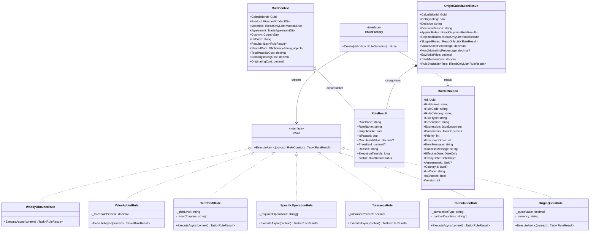
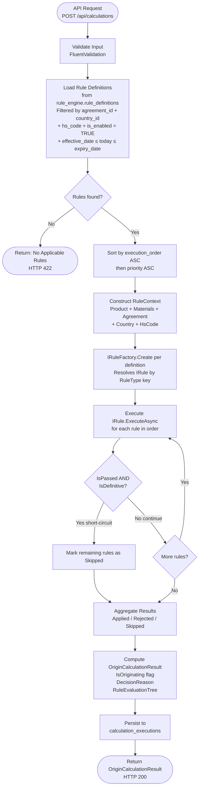
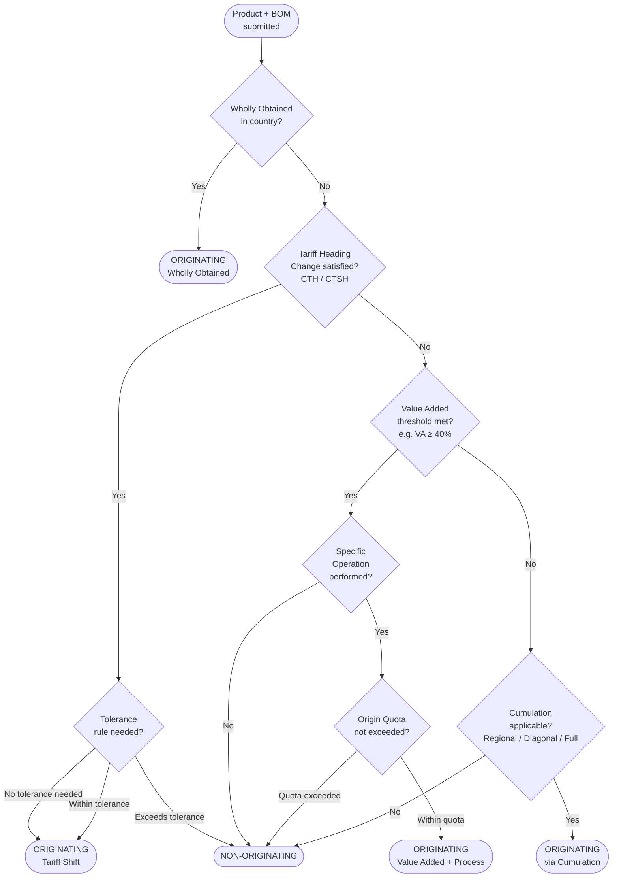

# Rule Engine Design Handbook
## Preferential Rules of Origin Calculation System — EU Trade Agreements

> Version: 1.0 | Last Updated: 2026-06-26 | Classification: Internal Engineering Reference

---

## Table of Contents

1. [Overview](#1-overview)
2. [Core Concepts](#2-core-concepts)
3. [Domain Model — Class Diagram](#3-domain-model--class-diagram)
4. [Execution Pipeline](#4-execution-pipeline)
5. [Origin Determination Decision Tree](#5-origin-determination-decision-tree)
6. [Strategy Pattern Implementation](#6-strategy-pattern-implementation)
7. [Factory Pattern](#7-factory-pattern)
8. [Specification Pattern](#8-specification-pattern)
9. [Chain of Responsibility](#9-chain-of-responsibility)
10. [Concrete Rule Types](#10-concrete-rule-types)
11. [Rule Categories](#11-rule-categories)
12. [Database Schema](#12-database-schema)
13. [Expression Engine](#13-expression-engine)
14. [Rule Versioning](#14-rule-versioning)
15. [Rule Parameters](#15-rule-parameters)
16. [Rule Dependencies](#16-rule-dependencies)
17. [Plugin Architecture](#17-plugin-architecture)
18. [Rule Builder UI](#18-rule-builder-ui)
19. [Rule Execution History](#19-rule-execution-history)
20. [Rule Visualization UI](#20-rule-visualization-ui)
21. [Rule Testing](#21-rule-testing)
22. [Rule Simulation](#22-rule-simulation)
23. [Rule Explanation](#23-rule-explanation)
24. [Implementing a New Rule Evaluator](#24-implementing-a-new-rule-evaluator)
25. [Future Extensibility](#25-future-extensibility)

---

## 1. Overview

### Why a Generic Rule Engine?

EU preferential trade agreements contain hundreds of product-specific rules scattered across annexes, protocols, and delegated regulations. Each HS code chapter can carry different origin requirements under every agreement — EU-Korea imposes CTH for textiles while EU-Canada CETA uses a value-added threshold for the same HS heading. Rules also change over time: a product that qualifies today may not qualify tomorrow when an agreement's transition period ends or an annex is revised.

Without a rule engine, each new trade agreement or rule change requires a software release — a code change, review cycle, deployment, and regression test. This cadence cannot keep pace with regulatory change. The EU currently maintains FTAs with over 70 countries; each agreement's annexes can contain 5,000+ product-specific rules.

### What "Metadata-Driven" Means

A metadata-driven rule engine separates **rule logic** (the evaluator code, written once) from **rule configuration** (the parameters, thresholds, and expressions, stored in the database). When a new trade agreement enters into force, operations staff insert rows into `rule_engine.rule_definitions` — no code deployment required. A `ValueAddedRule` evaluator written to check "is value added above threshold X?" becomes applicable to any agreement simply by setting `threshold_percent` in the `parameters` JSONB column.

The engine's contract is:
1. Load rule definitions from the database for the applicable (agreement, country, HS code) combination.
2. Resolve each definition to a concrete `IRule` evaluator class via the factory.
3. Execute evaluators in order, passing a shared `RuleContext`.
4. Aggregate results into an `OriginCalculationResult` with a full audit trail.

> **Fundamental Constraint — No Hard-Coded Business Logic**
>
> The Rule Engine **must not contain any hard-coded business rules, thresholds, or conditions**.
> Every rule, every threshold value (e.g., 40% Value Added), every applicable country list,
> and every execution condition is stored in the `rule_engine.rule_definitions` table in PostgreSQL.
> Adding a new trade regulation, changing a threshold, or disabling a rule requires ONLY a database
> change and UI configuration — **never a code change or application deployment**.

### Regulatory Basis

Rules of origin in the engine map to three legislative sources:

| Source | Scope | Rule Types Covered |
|--------|-------|--------------------|
| Protocol 1 of bilateral FTAs | Product-specific rules per HS heading | CTH, CTSH, Value Added, Specific Process |
| UCC Delegated Regulation Annex 22-03 | Non-preferential origin | Substantial Transformation |
| GSP Regulation (EU) 2015/2447 | Developing country preferences | Wholly Obtained, Cumulation |

---

## 2. Core Concepts

### IRule

The fundamental contract. Every rule evaluator — regardless of complexity — implements this single interface:

```csharp
public interface IRule
{
    Task<RuleResult> ExecuteAsync(RuleContext context);
}
```

The interface is intentionally minimal. The `RuleContext` carries all input data and accumulated results; the evaluator reads what it needs, computes its verdict, and returns a `RuleResult`. This makes each evaluator independently testable with zero framework dependencies.

### RuleContext

The shared execution state that flows through the entire pipeline. It is constructed once per calculation request and passed by reference to every evaluator.

```csharp
public class RuleContext
{
    public Guid CalculationId { get; set; }
    public FinishedProductDto Product { get; set; }
    public IReadOnlyList<MaterialDto> Materials { get; set; }
    public TradeAgreementDto Agreement { get; set; }
    public CountryDto Country { get; set; }
    public string HsCode { get; set; }
    public IList<RuleResult> Results { get; set; } = new List<RuleResult>();
    public IDictionary<string, object> SharedData { get; set; } = new Dictionary<string, object>();

    // Computed properties — derived from Materials list, not stored
    public decimal TotalMaterialCost => Materials.Sum(m => m.Cost);
    public decimal NonOriginatingCost => Materials.Where(m => !m.IsOriginating).Sum(m => m.Cost);
    public decimal OriginatingCost => Materials.Where(m => m.IsOriginating).Sum(m => m.Cost);
}
```

`SharedData` is the inter-rule communication channel. An upstream evaluator can publish a computed value (e.g., `"ValueAddedPercent"`) so downstream rules can read it without recomputing it. This avoids redundant LINQ passes over potentially large material lists.

### RuleResult

The output of a single rule evaluation. Every field is mandatory in the context of the Rule Explanation requirement.

```csharp
public class RuleResult
{
    public string RuleCode { get; set; }
    public string RuleName { get; set; }
    public bool IsApplicable { get; set; }
    public bool IsPassed { get; set; }
    public decimal? CalculatedValue { get; set; }
    public decimal? Threshold { get; set; }
    public string Reason { get; set; }
    public long ExecutionTimeMs { get; set; }
    public RuleResultStatus Status { get; set; }  // Passed, Failed, Skipped, Error
}
```

`IsApplicable` and `IsPassed` are distinct: a rule may be inapplicable (e.g., a WhollyObtained check when the product contains purchased materials) and should be marked `Skipped` rather than `Failed`. Only applicable rules that are also passed count toward the affirmative origin decision.

### RuleDefinition

The database entity that bridges configuration and code. Each row maps to exactly one evaluator class via `RuleType` (which matches a DI key).

Key fields:
- `RuleCode` — stable, unique identifier referenced in code and audit logs
- `RuleType` — maps to the concrete class name registered in DI (e.g., `"ValueAddedRule"`)
- `Parameters` — JSONB bag of evaluator-specific thresholds and options
- `Expression` — optional JSONB condition tree evaluated before or within the evaluator
- `ExecutionOrder` and `Priority` — control sequencing within the pipeline
- `EffectiveDate` / `ExpiryDate` — date-range validity for rule versioning

### RulePipeline

The orchestrator that loads, sorts, and executes rules for a single calculation. It is not a shared singleton — a new pipeline instance is constructed per request to avoid state leakage between concurrent calculations.

### RuleSet

A logical grouping of rules that apply to a specific (agreement, country, HS chapter range) combination. RuleSets are loaded from the database as a filtered, ordered collection of `RuleDefinition` rows.

### RuleCategory

A classification of what kind of origin test a rule performs. See [Section 11](#11-rule-categories) for the full enumeration. Categories determine pipeline short-circuit behavior and UI grouping.

### OriginCalculationResult

The final output returned to the API caller:

```csharp
public class OriginCalculationResult
{
    public Guid CalculationId { get; set; }
    public bool IsOriginating { get; set; }
    public string Decision { get; set; }          // "Originating" or "Non-Originating"
    public string DecisionReason { get; set; }
    public IReadOnlyList<RuleResult> AppliedRules { get; set; }
    public IReadOnlyList<RuleResult> RejectedRules { get; set; }
    public IReadOnlyList<RuleResult> SkippedRules { get; set; }
    public decimal? ValueAddedPercentage { get; set; }
    public decimal? NonOriginatingPercentage { get; set; }
    public decimal ExWorksPrice { get; set; }
    public decimal TotalMaterialCost { get; set; }
    public IReadOnlyList<RuleResult> RuleEvaluationTree { get; set; }
}
```

---

## 3. Domain Model — Class Diagram



---

## 4. Execution Pipeline



### Pipeline Detail

**Step 1 — Load from DB.** The repository executes a parameterised Dapper query returning `RuleDefinition` rows. Filtering criteria (agreement, country, HS code) are applied in SQL to avoid loading rules for unrelated contexts. Rules with `is_enabled = FALSE` are never loaded. The `effective_date` and `expiry_date` filter ensures the correct version for the transaction date.

**Step 2 — Sort.** Rules are sorted first by `execution_order` (coarse, e.g., 1 = WhollyObtained, 2 = CTH, 3 = ValueAdded), then by `priority` within the same execution_order bucket. This deterministic ordering is critical: some evaluators depend on earlier results stored in `SharedData`.

**Step 3 — Factory resolution.** The `IRuleFactory` resolves each `RuleDefinition.RuleType` string to the DI-registered `IRule` implementation using keyed service resolution. If no registration is found for a `RuleType`, the factory throws `RuleTypeNotFoundException` — this is a configuration error, not a calculation error, and surfaces immediately.

**Step 4 — Execute.** Each `IRule.ExecuteAsync(context)` receives the mutable `RuleContext`. Evaluators append their `RuleResult` to `context.Results` before returning. This allows downstream evaluators to inspect upstream outcomes.

**Step 5 — Short-circuit.** If a rule is marked as definitive (e.g., `WhollyObtainedRule` passes, confirming 100% originating content), the pipeline immediately marks all remaining rules as `Skipped` and proceeds to aggregation. Short-circuit logic is controlled by a flag on `RuleDefinition` (`is_short_circuit`) and the evaluator's `RuleResult.IsPassed` value.

**Step 6 — Aggregate.** Results are partitioned into `AppliedRules` (passed), `RejectedRules` (failed/error), and `SkippedRules`. The final `IsOriginating` decision requires at least one applicable rule to have passed with no blocking failures, unless the applied rule set allows alternative paths (OR logic configured in the rule set).

---

## 5. Origin Determination Decision Tree



### Reading the Tree

The tree represents the default evaluation sequence. Not every path is executed for every product — the engine only executes rules loaded from the database for the specific (agreement, HS code) combination. The tree shows logical precedence, not an unconditional waterfall.

---

## 6. Strategy Pattern Implementation

The Strategy pattern is the architectural backbone of the rule engine. Each origin rule type (WhollyObtained, ValueAdded, TariffShift, etc.) is a concrete strategy implementing `IRule`. The pipeline (`RulePipeline`) is the context that selects and invokes strategies at runtime.

### DI Registration — Keyed Services

.NET 8+ Keyed DI (`services.AddKeyedScoped`) maps `RuleDefinition.RuleType` strings to concrete evaluators:

```csharp
// Program.cs / ServiceCollectionExtensions.cs
public static IServiceCollection AddRuleEvaluators(this IServiceCollection services)
{
    services.AddKeyedScoped<IRule, WhollyObtainedRule>("WhollyObtainedRule");
    services.AddKeyedScoped<IRule, ValueAddedRule>("ValueAddedRule");
    services.AddKeyedScoped<IRule, TariffShiftRule>("TariffShiftRule");
    services.AddKeyedScoped<IRule, SpecificOperationRule>("SpecificOperationRule");
    services.AddKeyedScoped<IRule, ToleranceRule>("ToleranceRule");
    services.AddKeyedScoped<IRule, CumulationRule>("CumulationRule");
    services.AddKeyedScoped<IRule, OriginQuotaRule>("OriginQuotaRule");
    return services;
}
```

The key is the exact string stored in `rule_definitions.rule_type`. When a new evaluator is added, one `AddKeyedScoped` call and one `rule_definitions` row is all that is required.

### Resolution

```csharp
// Inside RuleFactory
var rule = _serviceProvider.GetRequiredKeyedService<IRule>(definition.RuleType);
```

If the key is not registered, `GetRequiredKeyedService` throws `InvalidOperationException`, which the factory wraps as `RuleTypeNotFoundException`.

---

## 7. Factory Pattern

`IRuleFactory` abstracts the DI resolution and parameter injection step. Its role is to turn a `RuleDefinition` (database row) into a ready-to-execute `IRule` instance.

```csharp
public interface IRuleFactory
{
    IRule Create(RuleDefinition definition);
}

public class RuleFactory : IRuleFactory
{
    private readonly IServiceProvider _serviceProvider;

    public RuleFactory(IServiceProvider serviceProvider)
        => _serviceProvider = serviceProvider;

    public IRule Create(RuleDefinition definition)
    {
        if (string.IsNullOrWhiteSpace(definition.RuleType))
            throw new ArgumentException("RuleDefinition.RuleType must be set.", nameof(definition));

        var rule = _serviceProvider.GetRequiredKeyedService<IRule>(definition.RuleType);

        // Inject parameters from JSONB into the evaluator via a configurable interface
        if (rule is IConfigurableRule configurableRule)
            configurableRule.Configure(definition.Parameters);

        return rule;
    }
}
```

`IConfigurableRule` is an optional secondary interface that allows the factory to push JSONB parameters into the evaluator after creation:

```csharp
public interface IConfigurableRule
{
    void Configure(JsonDocument parameters);
}
```

Evaluators that need parameters (ValueAdded, TariffShift, etc.) implement both `IRule` and `IConfigurableRule`. Evaluators with no parameters (WhollyObtained) implement only `IRule`.

---

## 8. Specification Pattern

Pre-conditions that determine whether a rule is applicable to the current context are modelled as specifications. This separates "should this rule run?" from "what is the result?".

```csharp
public interface ISpecification<T>
{
    bool IsSatisfiedBy(T candidate);
}

public class AndSpecification<T> : ISpecification<T>
{
    private readonly ISpecification<T> _left;
    private readonly ISpecification<T> _right;
    public AndSpecification(ISpecification<T> left, ISpecification<T> right)
        => (_left, _right) = (left, right);
    public bool IsSatisfiedBy(T candidate)
        => _left.IsSatisfiedBy(candidate) && _right.IsSatisfiedBy(candidate);
}

public class OrSpecification<T> : ISpecification<T>
{
    private readonly ISpecification<T> _left;
    private readonly ISpecification<T> _right;
    public OrSpecification(ISpecification<T> left, ISpecification<T> right)
        => (_left, _right) = (left, right);
    public bool IsSatisfiedBy(T candidate)
        => _left.IsSatisfiedBy(candidate) || _right.IsSatisfiedBy(candidate);
}

public class NotSpecification<T> : ISpecification<T>
{
    private readonly ISpecification<T> _inner;
    public NotSpecification(ISpecification<T> inner) => _inner = inner;
    public bool IsSatisfiedBy(T candidate) => !_inner.IsSatisfiedBy(candidate);
}
```

Example usage — an `HsCodeApplicabilitySpecification` returns `true` only when the product's HS heading matches the rule's configured code range:

```csharp
public class HsCodeApplicabilitySpecification : ISpecification<RuleContext>
{
    private readonly string _hsCodePrefix;
    public HsCodeApplicabilitySpecification(string hsCodePrefix)
        => _hsCodePrefix = hsCodePrefix;
    public bool IsSatisfiedBy(RuleContext context)
        => context.HsCode.StartsWith(_hsCodePrefix, StringComparison.OrdinalIgnoreCase);
}
```

If a specification is not satisfied, the evaluator sets `IsApplicable = false` and `Status = RuleResultStatus.Skipped` without performing any calculation.

---

## 9. Chain of Responsibility

The `RulePipeline` implements a Chain of Responsibility. Each rule in the ordered list is a link in the chain. Rules pass control to the next link after execution unless a short-circuit condition is met.

### Short-Circuit Rules

| Trigger | Behavior |
|---------|----------|
| `WhollyObtainedRule` passes | Product is definitively originating; all remaining rules skipped |
| Any rule with `is_definitive = true` passes | Same — immediate termination of the chain |
| A rule with `Status = Error` | Error is recorded; pipeline continues unless `fail_fast = true` on the rule set |
| All rules exhausted without a pass | Product is non-originating |

### Pass-Through on Inconclusive

If a rule returns `IsApplicable = false` (specification not met), the pipeline skips it silently. The chain continues to the next link. This is distinct from a failed rule: a skipped rule does not negatively contribute to the decision.

```csharp
public class RulePipeline
{
    private readonly IRuleFactory _factory;

    public async Task<OriginCalculationResult> ExecuteAsync(
        IReadOnlyList<RuleDefinition> definitions,
        RuleContext context)
    {
        foreach (var definition in definitions.OrderBy(d => d.ExecutionOrder).ThenBy(d => d.Priority))
        {
            var rule = _factory.Create(definition);
            var sw = Stopwatch.StartNew();
            var result = await rule.ExecuteAsync(context);
            sw.Stop();
            result.ExecutionTimeMs = sw.ElapsedMilliseconds;
            context.Results.Add(result);

            if (result.IsApplicable && result.IsPassed && definition.IsDefinitive)
                break; // short-circuit
        }
        return BuildResult(context);
    }
}
```

---

## 10. Concrete Rule Types

### 10.1 WhollyObtainedRule

**What it evaluates:** Whether the finished product was entirely obtained within the country of production — no non-originating materials whatsoever. This rule covers natural products: minerals extracted from the ground, live animals born and raised in the country, fish caught in the country's territorial waters, and products manufactured exclusively from such materials.

**Evaluation logic:** The rule checks that `context.NonOriginatingCost == 0` and, optionally, that the product falls within a WhollyObtained commodity category (configurable per agreement). If any non-originating material exists in the BOM, the rule immediately returns `IsPassed = false`.

**Position in pipeline:** Always `execution_order = 1`. If it passes, the pipeline short-circuits — no further rules run.

**Parameters:** None. This rule has no configurable thresholds.

```json
{}
```

**Example RuleResult:**
```json
{
  "ruleCode": "WO-001",
  "ruleName": "Wholly Obtained",
  "isApplicable": true,
  "isPassed": false,
  "calculatedValue": 1250.00,
  "threshold": 0,
  "reason": "Product contains 1,250 EUR of non-originating materials. Wholly Obtained criterion cannot be satisfied.",
  "status": "Failed"
}
```

---

### 10.2 ValueAddedRule

**What it evaluates:** Whether the value added in the country of production exceeds a minimum percentage of the ex-works price. This is the primary rule for substantial transformation under most bilateral FTAs.

**Formula:**

```
ValueAddedPercent = (ExWorksPrice - NonOriginatingCost) / ExWorksPrice * 100
```

The result must be greater than or equal to `threshold_percent`.

**Parameters:**

```json
{ "threshold_percent": 40 }
```

| Parameter | Type | Description |
|-----------|------|-------------|
| `threshold_percent` | decimal | Minimum value-added percentage required (typically 40–60%) |

**Evaluation logic:** The rule reads `ExWorksPrice` from `context.Product.ExWorksPrice` and `NonOriginatingCost` from the context computed property. It publishes `"ValueAddedPercent"` to `context.SharedData` for use by downstream evaluators or the explanation layer.

**Example RuleResult:**
```json
{
  "ruleCode": "VA-001",
  "ruleName": "Minimum Value Added 40%",
  "isApplicable": true,
  "isPassed": true,
  "calculatedValue": 47.5,
  "threshold": 40.0,
  "reason": "Value added of 47.5% exceeds the required 40% threshold.",
  "status": "Passed"
}
```

---

### 10.3 TariffShiftRule

**What it evaluates:** Change of Tariff Heading (CTH) or Change of Tariff Sub-Heading (CTSH). The rule confirms that the finished product's HS code is in a different chapter, heading, or sub-heading than the non-originating input materials. This test reflects "substantial transformation" when a manufacturing process changes the tariff classification of the inputs.

**Shift levels:**

| Level | Meaning | Example |
|-------|---------|---------|
| `chapter` | CC — HS 2-digit chapter changes | Iron ore (Ch. 26) → Steel pipe (Ch. 73) |
| `heading` | CTH — HS 4-digit heading changes | Wire rod (7213) → Bolt (7318) |
| `subheading` | CTSH — HS 6-digit subheading changes | Within same heading |

**Parameters:**

```json
{
  "shift_level": "heading",
  "from_chapters": ["72", "73"],
  "to_chapter": "84"
}
```

| Parameter | Type | Description |
|-----------|------|-------------|
| `shift_level` | string | `"chapter"`, `"heading"`, or `"subheading"` |
| `from_chapters` | string[] | HS chapter codes of non-originating inputs |
| `to_chapter` | string | Required HS chapter of the finished product |

**Evaluation logic:** For each non-originating material, the rule extracts its HS code chapter (first 2 digits), heading (first 4 digits), or subheading (first 6 digits) and verifies the required tariff shift. If all non-originating materials satisfy the shift, `IsPassed = true`.

---

### 10.4 SpecificOperationRule

**What it evaluates:** Whether specific manufacturing or processing operations were performed on the product in the country of production. This rule is used for agreements that require a defined industrial process rather than a tariff shift or value test — common in textiles (EU–Turkey Customs Union) and chemicals.

**Parameters:**

```json
{ "required_operations": ["weaving", "spinning"] }
```

| Parameter | Type | Description |
|-----------|------|-------------|
| `required_operations` | string[] | List of operation codes that must be attested |

**Evaluation logic:** The rule checks `context.Product.PerformedOperations` (a list of operation codes declared by the manufacturer) against `required_operations`. All required operations must be present. If any required operation is missing, the rule fails and lists the missing operations in `Reason`.

**Example RuleResult:**
```json
{
  "ruleCode": "SP-001",
  "ruleName": "Specific Process — Weaving + Spinning",
  "isApplicable": true,
  "isPassed": false,
  "reason": "Required operation 'spinning' was not declared. Present operations: weaving.",
  "status": "Failed"
}
```

---

### 10.5 ToleranceRule

**What it evaluates:** Whether the non-originating materials that failed the tariff shift test fall below a tolerance threshold (also called the "de minimis" rule). EU trade agreements typically allow up to 10% of the ex-works price to consist of non-originating materials that would otherwise violate CTH, without failing the overall origin test.

**Parameters:**

```json
{ "tolerance_percent": 10 }
```

| Parameter | Type | Description |
|-----------|------|-------------|
| `tolerance_percent` | decimal | Maximum allowable percentage of non-CTH-compliant non-originating materials |

**Evaluation logic:** The rule reads the set of non-originating materials that triggered a `TariffShiftRule` failure (published by `TariffShiftRule` to `context.SharedData["NonCthCompliantCost"]`). It divides that cost by `ExWorksPrice`. If the percentage is within tolerance, the rule passes and overrides the TariffShift failure.

**Note:** Tolerance does not apply to all product categories. Specific agreements exclude textiles (HS chapters 50–63) and certain agricultural goods. The `parameters` JSONB can carry an `excluded_hs_chapters` array.

---

### 10.6 CumulationRule

**What it evaluates:** Whether materials sourced from partner countries within a cumulation zone can be treated as originating, effectively increasing the value-added percentage or satisfying a tariff shift. Cumulation is a significant preference under modern EU FTAs.

**Cumulation types:**

| Type | Description |
|------|-------------|
| Regional | Materials from any country in the same regional group count as originating |
| Diagonal | Bilateral agreements allow materials from named third countries to cumulate |
| Full | Any processing in a partner country counts, not just the final sufficient transformation |

**Parameters:**

```json
{
  "cumulation_type": "diagonal",
  "partner_countries": ["DE", "FR", "IT"]
}
```

| Parameter | Type | Description |
|-----------|------|-------------|
| `cumulation_type` | string | `"regional"`, `"diagonal"`, or `"full"` |
| `partner_countries` | string[] | ISO 3166-1 alpha-2 codes of countries whose materials can cumulate |

**Evaluation logic:** The rule re-classifies materials whose `OriginCountryCode` appears in `partner_countries` as originating for the purpose of this calculation. It then re-computes `NonOriginatingCost` and re-evaluates the value-added percentage. If cumulation tips the product into compliance, the rule passes and records the cumulation-adjusted figures in `SharedData`.

---

### 10.7 OriginQuotaRule

**What it evaluates:** Whether the total value of non-originating materials used falls within an absolute monetary quota permitted by the trade agreement. Some agreements cap non-originating content by absolute value (EUR) rather than percentage.

**Parameters:**

```json
{ "quota_value": 500000, "currency": "EUR" }
```

| Parameter | Type | Description |
|-----------|------|-------------|
| `quota_value` | decimal | Maximum monetary value of non-originating materials allowed |
| `currency` | string | ISO 4217 currency code (always EUR for EU agreements) |

**Evaluation logic:** The rule sums `NonOriginatingCost` from context. If it exceeds `quota_value`, the rule fails. Currency conversion (if materials are denominated in non-EUR currencies) must be applied before the check using the exchange rate stored in `context.SharedData["ExchangeRate"]`.

---

## 11. Rule Categories

### Core Principles

- **No Hard-Coded Logic**: All business rules are database-driven. The engine is a generic orchestrator only.

### Category List

| Category Constant | Description | Typical Execution Order |
|-------------------|-------------|------------------------|
| `WhollyObtained` | Product entirely obtained in country — no transformation required | 1 |
| `TariffShift` (CTH/CTSH) | Change of tariff heading or subheading for non-originating inputs | 2 |
| `SubstantialTransformation` | General sufficient manufacturing/processing test | 2 |
| `ValueAdded` / `MaxNOM` | Minimum value added or maximum non-originating materials | 3 |
| `SpecificProcess` | Mandatory manufacturing operations | 4 |
| `Tolerance` | De minimis allowance for non-compliant non-originating materials | 5 |
| `Cumulation` | Regional, diagonal, or full cumulation with partner countries | 6 |
| `OriginQuota` | Absolute monetary cap on non-originating materials | 7 |

Categories are stored in `rule_definitions.rule_category` and used by the UI for grouping and by the pipeline for category-level short-circuit decisions.

---

## 12. Database Schema

### SQL DDL

```sql
-- Schema
CREATE SCHEMA IF NOT EXISTS rule_engine;

-- Core rule definitions table
CREATE TABLE rule_engine.rule_definitions (
  id                UUID        PRIMARY KEY DEFAULT gen_random_uuid(),
  rule_name         VARCHAR(200) NOT NULL,
  rule_code         VARCHAR(100) NOT NULL UNIQUE,
  rule_category     VARCHAR(50)  NOT NULL,
    -- Allowed values: 'WhollyObtained','ValueAdded','TariffShift','SpecificProcess',
    --                 'Tolerance','Cumulation','OriginQuota','SubstantialTransformation'
  rule_type         VARCHAR(100) NOT NULL,
    -- Maps to the IRule implementation class name registered in DI (e.g. 'ValueAddedRule')
  description       TEXT,
  expression        JSONB,
    -- Optional pre-condition expression tree evaluated before ExecuteAsync
  parameters        JSONB,
    -- Evaluator-specific parameter bag (threshold_percent, quota_value, etc.)
  priority          INT          NOT NULL DEFAULT 100,
  execution_order   INT          NOT NULL DEFAULT 1,
  is_definitive     BOOLEAN      NOT NULL DEFAULT FALSE,
    -- If TRUE and rule passes, pipeline short-circuits
  error_message     TEXT,
    -- Human-readable message when rule fails (supports token substitution: {CalculatedValue}, {Threshold})
  success_message   TEXT,
    -- Human-readable message when rule passes
  effective_date    DATE         NOT NULL,
  expiry_date       DATE,
    -- NULL means no expiry (rule remains active indefinitely)
  agreement_id      UUID         REFERENCES trade_agreements(id),
    -- NULL means the rule applies to all agreements
  country_id        UUID         REFERENCES countries(id),
    -- NULL means the rule applies to all countries
  hs_code           VARCHAR(10),
    -- NULL means applies to all HS codes; prefix match used (e.g. '72' matches 720100)
  is_enabled        BOOLEAN      NOT NULL DEFAULT TRUE,
  version           INT          NOT NULL DEFAULT 1,
  -- Audit fields
  created_by        VARCHAR(256) NOT NULL,
  created_at        TIMESTAMPTZ  NOT NULL DEFAULT NOW(),
  updated_by        VARCHAR(256),
  updated_at        TIMESTAMPTZ,
  ip_address        VARCHAR(45),
  machine           VARCHAR(256)
);

-- Indexes for the most common filter combinations
CREATE INDEX idx_rule_definitions_agreement_country
    ON rule_engine.rule_definitions (agreement_id, country_id);

CREATE INDEX idx_rule_definitions_hs_code
    ON rule_engine.rule_definitions (hs_code text_pattern_ops);

CREATE INDEX idx_rule_definitions_effective
    ON rule_engine.rule_definitions (effective_date, expiry_date)
    WHERE is_enabled = TRUE;

-- Version history — one row per save of a rule_definition
CREATE TABLE rule_engine.rule_definition_history (
  id                UUID        PRIMARY KEY DEFAULT gen_random_uuid(),
  rule_definition_id UUID       NOT NULL REFERENCES rule_engine.rule_definitions(id),
  version           INT         NOT NULL,
  snapshot          JSONB       NOT NULL,  -- full row serialised as JSON at time of change
  changed_by        VARCHAR(256) NOT NULL,
  changed_at        TIMESTAMPTZ  NOT NULL DEFAULT NOW(),
  change_reason     TEXT
);
```

### C# Entity

```csharp
namespace PraeferenzSystem.RuleEngine.Domain.Entities;

public class RuleDefinition
{
    public Guid Id { get; set; }
    public string RuleName { get; set; } = string.Empty;
    public string RuleCode { get; set; } = string.Empty;
    public string RuleCategory { get; set; } = string.Empty;
    public string RuleType { get; set; } = string.Empty;
    public string? Description { get; set; }
    public JsonDocument? Expression { get; set; }
    public JsonDocument? Parameters { get; set; }
    public int Priority { get; set; } = 100;
    public int ExecutionOrder { get; set; } = 1;
    public bool IsDefinitive { get; set; }
    public string? ErrorMessage { get; set; }
    public string? SuccessMessage { get; set; }
    public DateOnly EffectiveDate { get; set; }
    public DateOnly? ExpiryDate { get; set; }
    public Guid? AgreementId { get; set; }
    public Guid? CountryId { get; set; }
    public string? HsCode { get; set; }
    public bool IsEnabled { get; set; } = true;
    public int Version { get; set; } = 1;
    // Audit
    public string CreatedBy { get; set; } = string.Empty;
    public DateTimeOffset CreatedAt { get; set; }
    public string? UpdatedBy { get; set; }
    public DateTimeOffset? UpdatedAt { get; set; }
    public string? IpAddress { get; set; }
    public string? Machine { get; set; }
}
```

### Sample Rule Row — ValueAdded

```sql
INSERT INTO rule_engine.rule_definitions (
  rule_name, rule_code, rule_category, rule_type,
  description, parameters, priority, execution_order,
  is_definitive, effective_date, agreement_id,
  error_message, success_message, created_by
) VALUES (
  'Minimum Value Added 40% — EU-Korea FTA',
  'VA-EU-KR-001',
  'ValueAdded',
  'ValueAddedRule',
  'Article 6(1) of Protocol 1 to the EU-Korea FTA. Value added must be at least 40% of ex-works price.',
  '{"threshold_percent": 40}'::jsonb,
  100, 3,
  FALSE,
  '2011-07-01',
  (SELECT id FROM trade_agreements WHERE code = 'EU-KR'),
  'Value added of {CalculatedValue}% does not meet the 40% threshold required under EU-Korea FTA.',
  'Value added of {CalculatedValue}% satisfies the 40% minimum under EU-Korea FTA.',
  'admin@system'
);
```

---

## 13. Expression Engine

### Purpose

The `expression` JSONB column stores an optional pre-condition tree that is evaluated before the main `IRule.ExecuteAsync` logic runs. This allows the same evaluator class to be scoped to specific contexts (e.g., "only run this ValueAdded rule when the country is in the EU") without writing a new evaluator class.

### Expression Grammar

Expressions are JSON objects with an `operator` field and operands. The engine supports:

| Operator | Operand Types | Example |
|----------|---------------|---------|
| `>`, `>=`, `<`, `<=` | numeric comparisons | `{"operator": ">", "left": "ValueAddedPercent", "right": "40"}` |
| `==`, `!=` | string/numeric equality | `{"operator": "==", "left": "CountryCode", "right": "DE"}` |
| `IN` | membership | `{"operator": "IN", "left": "Country.Region", "right": ["EU", "EEA"]}` |
| `AND` | composite | `{"operator": "AND", "conditions": [...]}` |
| `OR` | composite | `{"operator": "OR", "conditions": [...]}` |
| `NOT` | negation | `{"operator": "NOT", "condition": {...}}` |

### Examples

```json
// ValueAdded rule condition — only applicable when computed VA > 40
{ "operator": ">", "left": "ValueAddedPercent", "right": "40" }

// Country check — only applicable for Germany
{ "operator": "==", "left": "CountryCode", "right": "DE" }

// Combined — VA > 40 AND country is EU or EEA member
{
  "operator": "AND",
  "conditions": [
    { "operator": ">", "left": "ValueAddedPercent", "right": "40" },
    { "operator": "IN", "left": "Country.Region", "right": ["EU", "EEA"] }
  ]
}

// Exclude specific HS chapter from tolerance rule
{
  "operator": "NOT",
  "condition": {
    "operator": "IN",
    "left": "HsCode.Chapter",
    "right": ["50", "51", "52", "53", "54", "55", "56", "57", "58", "59", "60", "61", "62", "63"]
  }
}
```

### IExpressionEvaluator

The expression evaluator is a pluggable interface, making it replaceable if a more powerful expression language is needed in future:

```csharp
public interface IExpressionEvaluator
{
    bool Evaluate(JsonDocument expression, RuleContext context);
}
```

The default implementation is a recursive tree walker — no third-party expression library dependency, keeping the engine self-contained and avoiding security risks from arbitrary code evaluation.

Left-hand operand identifiers resolve against `RuleContext` properties and `SharedData` keys. Unknown identifiers throw `ExpressionResolutionException`, which surfaces as a configuration error.

---

## 14. Rule Versioning

### Date-Range Versioning

Every `RuleDefinition` row carries `effective_date` and `expiry_date`. The pipeline filter applies:

```sql
WHERE effective_date <= :transactionDate
  AND (expiry_date IS NULL OR expiry_date >= :transactionDate)
  AND is_enabled = TRUE
```

`transactionDate` defaults to `CURRENT_DATE` for live calculations but can be overridden for historical recalculations (important for post-clearance customs audits where origin must be re-assessed as at the export date).

### Version History Table

Every write to `rule_definitions` (INSERT or UPDATE) triggers a PostgreSQL function that appends a snapshot row to `rule_definition_history`. The snapshot captures the entire row as JSONB. This provides a complete changelog:

- Who changed the rule and when
- What the rule configuration looked like at any point in time
- The reason for the change (free-text, captured via the Rule Builder UI)

### Loading the Correct Version

For audit trail purposes, `calculation_executions` stores the `RuleDefinition.version` that was active at calculation time. If a rule is later revised, historical calculations can be replayed against the correct rule version by loading from `rule_definition_history`.

### Rule Promotion Workflow

1. Ops staff creates a new rule in the Rule Builder UI with a future `effective_date`.
2. The simulation endpoint (`POST /api/calculations/simulate`) can test the rule against sample data before it activates.
3. On `effective_date`, the new rule automatically enters the active set — no deployment required.
4. The old rule, if still in the table with its `expiry_date` set to the day before, is excluded by the filter.

---

## 15. Rule Parameters

### Type System

Parameters are stored as JSONB, but the engine imposes a typed parameter schema per `RuleCategory`. Parameter types:

| Type Token | .NET Type | Validation |
|------------|-----------|------------|
| `decimal` | `decimal` | Must be positive |
| `percentage` | `decimal` | Must be in range 0–100 |
| `hsCode` | `string` | Must match `^\d{2,10}$` |
| `countryCode` | `string` | Must be valid ISO 3166-1 alpha-2 |
| `currency` | `string` | Must be valid ISO 4217 |
| `operationCode` | `string` | Must exist in `manufacturing_operations` table |
| `cumulationType` | `string` | Must be one of `regional`, `diagonal`, `full` |

### Validation

Before a rule is saved via the Rule Builder UI, `RuleDefinitionValidator` (FluentValidation) deserialises the `parameters` JSONB and validates each field against the expected schema for `rule_type`. Validation errors are returned to the UI before persisting.

```csharp
public class ValueAddedRuleParametersValidator : AbstractValidator<ValueAddedRuleParameters>
{
    public ValueAddedRuleParametersValidator()
    {
        RuleFor(x => x.ThresholdPercent)
            .InclusiveBetween(1m, 100m)
            .WithMessage("Threshold must be between 1% and 100%.");
    }
}
```

---

## 16. Rule Dependencies

### Dependency Declaration

A rule can declare that it requires the result of another rule to have been computed first. Dependencies are stored in `rule_definitions.parameters` as an optional `depends_on` array:

```json
{
  "threshold_percent": 10,
  "depends_on": ["VA-EU-KR-001"]
}
```

The pipeline validator reads dependency declarations before execution and ensures:
1. All declared dependencies exist in the loaded rule set.
2. Dependencies are ordered before the dependent rule (enforced by `execution_order`).

### Dependency Graph

At rule set load time, the pipeline builds a directed acyclic graph (DAG) of rule dependencies. If a cycle is detected (Rule A depends on Rule B which depends on Rule A), the pipeline throws `RuleCyclicDependencyException` before any execution begins. The error message lists the cycle path for immediate operator diagnosis.

### Inter-Rule Communication

The mechanism for passing computed values between rules is `context.SharedData`. Convention for key names:

| Published by | Key | Value |
|--------------|-----|-------|
| `ValueAddedRule` | `"ValueAddedPercent"` | Computed VA% as decimal |
| `TariffShiftRule` | `"NonCthCompliantCost"` | Sum of non-CTH-compliant non-originating material costs |
| `CumulationRule` | `"CumulationAdjustedNonOriginatingCost"` | Non-originating cost after cumulation re-classification |

These keys are documented as a stable API contract — changing them is a breaking change requiring a version bump.

---

## 17. Plugin Architecture

### IEvaluatorPlugin

For scenarios where a new rule type is sufficiently complex to warrant its own assembly (e.g., sector-specific rules for aerospace or pharmaceuticals), the engine supports plugin-based evaluator discovery:

```csharp
public interface IEvaluatorPlugin
{
    string EvaluatorTypeKey { get; }      // Must match rule_definitions.rule_type
    Type EvaluatorImplementationType { get; }
    ServiceLifetime Lifetime { get; }     // Scoped recommended
}
```

### Assembly Scanning

On startup, the plugin loader scans a configurable plugin directory for assemblies containing `IEvaluatorPlugin` implementations:

```csharp
public static IServiceCollection AddRuleEnginePlugins(
    this IServiceCollection services,
    string pluginDirectory)
{
    foreach (var assemblyPath in Directory.GetFiles(pluginDirectory, "*.Plugin.dll"))
    {
        var assembly = Assembly.LoadFrom(assemblyPath);
        var pluginTypes = assembly.GetTypes()
            .Where(t => typeof(IEvaluatorPlugin).IsAssignableFrom(t) && !t.IsAbstract);

        foreach (var pluginType in pluginTypes)
        {
            var plugin = (IEvaluatorPlugin)Activator.CreateInstance(pluginType)!;
            services.AddKeyedScoped(
                typeof(IRule),
                plugin.EvaluatorTypeKey,
                plugin.EvaluatorImplementationType);
        }
    }
    return services;
}
```

### Plugin Isolation

Each plugin assembly runs in its own `AssemblyLoadContext` to prevent DLL version conflicts with the host application. Plugins are given access only to the `PraeferenzSystem.RuleEngine.Abstractions` package, which contains `IRule`, `RuleContext`, `RuleResult`, and `IConfigurableRule`.

---

## 18. Rule Builder UI

The Rule Builder is the admin interface for managing rule definitions without code deployments. It maps 1:1 to the `rule_definitions` table.

### Form Fields

| UI Label | DB Column | Input Type | Validation |
|----------|-----------|------------|------------|
| Rule Name | `rule_name` | Text | Required, max 200 chars |
| Rule Code | `rule_code` | Text | Required, unique, uppercase enforced |
| Category | `rule_category` | Select | Enum values from Section 11 |
| Evaluator Type | `rule_type` | Select | Populated from registered DI keys |
| Description | `description` | Textarea | Optional |
| Parameters | `parameters` | JSON Editor | Validated against evaluator schema |
| Expression | `expression` | JSON Editor | Optional; validated against expression grammar |
| Priority | `priority` | Number | Integer ≥ 1 |
| Execution Order | `execution_order` | Number | Integer ≥ 1 |
| Is Definitive | `is_definitive` | Toggle | Boolean |
| Error Message | `error_message` | Text | Supports {CalculatedValue}, {Threshold} tokens |
| Success Message | `success_message` | Text | Supports {CalculatedValue}, {Threshold} tokens |
| Effective From | `effective_date` | Date | Required; must not be in the past for new rules |
| Effective To | `expiry_date` | Date | Optional; must be after Effective From |
| Trade Agreement | `agreement_id` | Select | References trade_agreements table |
| Country | `country_id` | Select | References countries table |
| HS Code | `hs_code` | Text | Numeric, max 10 digits; prefix match |
| Enabled | `is_enabled` | Toggle | Boolean |

### Actions

- **Save as Draft** — saves with `is_enabled = FALSE`; rule will not execute
- **Publish** — sets `is_enabled = TRUE` and `effective_date`; triggers version history record
- **Clone** — creates a copy with a new `rule_code` (auto-generated suffix) and `is_enabled = FALSE`
- **Disable** — sets `is_enabled = FALSE` without deleting; audit trail preserved
- **Test** — runs the rule against a manually entered sample `RuleContext` (dry-run, not persisted)
- **Version History** — opens a modal listing all rows from `rule_definition_history` for this rule

### Test Mode

The "Test" action calls `POST /api/calculations/simulate` with the rule code and a manually-entered sample input. The response displays the `RuleEvaluationTree` for just that rule, rendered in the Rule Visualization UI component, without persisting any calculation record.

---

## 19. Rule Execution History

### calculation_executions Table

```sql
CREATE TABLE rule_engine.calculation_executions (
  id                  UUID        PRIMARY KEY DEFAULT gen_random_uuid(),
  calculation_id      UUID        NOT NULL UNIQUE,
  product_id          UUID        NOT NULL REFERENCES products(id),
  agreement_id        UUID        NOT NULL REFERENCES trade_agreements(id),
  country_id          UUID        NOT NULL REFERENCES countries(id),
  hs_code             VARCHAR(10) NOT NULL,
  user_id             VARCHAR(256) NOT NULL,
  executed_at         TIMESTAMPTZ NOT NULL DEFAULT NOW(),
  transaction_date    DATE        NOT NULL,
  is_originating      BOOLEAN     NOT NULL,
  decision            VARCHAR(50) NOT NULL,  -- 'Originating' or 'Non-Originating'
  decision_reason     TEXT,
  rules_executed      JSONB       NOT NULL,  -- array of {rule_code, rule_version}
  rule_results        JSONB       NOT NULL,  -- full RuleEvaluationTree serialised
  pass_fail           BOOLEAN     NOT NULL,
  execution_time_ms   BIGINT      NOT NULL,
  input_data          JSONB       NOT NULL,  -- serialised RuleContext at time of execution
  output_data         JSONB       NOT NULL,  -- serialised OriginCalculationResult
  is_simulation       BOOLEAN     NOT NULL DEFAULT FALSE,
  client_ip           VARCHAR(45),
  machine             VARCHAR(256)
);

CREATE INDEX idx_calc_exec_product ON rule_engine.calculation_executions (product_id);
CREATE INDEX idx_calc_exec_agreement ON rule_engine.calculation_executions (agreement_id);
CREATE INDEX idx_calc_exec_executed_at ON rule_engine.calculation_executions (executed_at DESC);
```

Simulation runs (`POST /api/calculations/simulate`) are stored with `is_simulation = TRUE`. This allows auditors to distinguish live determinations from what-if analyses.

---

## 20. Rule Visualization UI

### Layout

The Rule Visualization UI is a React component rendered after every calculation. It displays a vertical workflow diagram where each row represents one rule in execution order.

### Color Coding

| Status | Background | Icon |
|--------|------------|------|
| `Passed` | Green (#16a34a) | Checkmark |
| `Failed` | Red (#dc2626) | X |
| `Skipped` | Grey (#9ca3af) | Dash |
| `Error` | Orange (#d97706) | Warning triangle |

### Row Content

Each rule row displays:
- Rule name and code
- `IsApplicable` badge
- `CalculatedValue` vs `Threshold` (shown as a progress bar for percentage rules)
- `Reason` text (the human-readable explanation from `RuleResult.Reason`)
- `ExecutionTimeMs` in grey micro-text

### Final Decision Banner

Below the rule list, a prominent banner shows the final `Decision` ("Originating" or "Non-Originating") in large green or red text with `DecisionReason`. This banner is the primary output users screenshot for customs documentation.

### Implementation Note

The component receives `OriginCalculationResult.RuleEvaluationTree` as its data prop. It does not make additional API calls — all data is available in the initial calculation response.

---

## 21. Rule Testing

### Test Strategy

Every evaluator must have three categories of unit tests:

1. **Pass scenario** — context where the rule should return `IsPassed = true`
2. **Fail scenario** — context where the rule should return `IsPassed = false`
3. **Boundary case** — context exactly at the threshold (e.g., VA = exactly 40%)

### Test Matrix Format

Document each rule's test coverage as a matrix:

| Test Name | ExWorksPrice | NonOriginatingCost | VA% | Expected | Status |
|-----------|-------------|-------------------|-----|----------|--------|
| VA_Pass_Above40 | 10,000 | 5,800 | 42.0% | Passed | Passed |
| VA_Fail_Below40 | 10,000 | 7,000 | 30.0% | Failed | Failed |
| VA_Boundary_Exact40 | 10,000 | 6,000 | 40.0% | Passed (inclusive) | Passed |
| VA_ZeroMaterials | 10,000 | 0 | 100.0% | Passed | Passed |
| VA_NegativeValue | 10,000 | 11,000 | -10.0% | Failed | Failed |

### Unit Test Example

```csharp
public class ValueAddedRuleTests
{
    private static RuleContext BuildContext(decimal exWorksPrice, decimal nonOriginatingCost)
    {
        var materials = new List<MaterialDto>
        {
            new() { Cost = nonOriginatingCost, IsOriginating = false }
        };
        return new RuleContext
        {
            CalculationId = Guid.NewGuid(),
            HsCode = "840730",
            Product = new FinishedProductDto { ExWorksPrice = exWorksPrice },
            Materials = materials,
            Agreement = new TradeAgreementDto { Code = "EU-KR" },
            Country = new CountryDto { Code = "KR" }
        };
    }

    [Fact]
    public async Task ExecuteAsync_ShouldPass_WhenValueAddedExceedsThreshold()
    {
        // Arrange
        var parameters = JsonDocument.Parse("""{"threshold_percent": 40}""");
        var rule = new ValueAddedRule();
        ((IConfigurableRule)rule).Configure(parameters);
        var context = BuildContext(10_000m, 5_800m);  // VA = 42%

        // Act
        var result = await rule.ExecuteAsync(context);

        // Assert
        result.IsPassed.Should().BeTrue();
        result.CalculatedValue.Should().BeApproximately(42.0m, 0.01m);
        result.Status.Should().Be(RuleResultStatus.Passed);
    }

    [Fact]
    public async Task ExecuteAsync_ShouldFail_WhenValueAddedBelowThreshold()
    {
        var parameters = JsonDocument.Parse("""{"threshold_percent": 40}""");
        var rule = new ValueAddedRule();
        ((IConfigurableRule)rule).Configure(parameters);
        var context = BuildContext(10_000m, 7_000m);  // VA = 30%

        var result = await rule.ExecuteAsync(context);

        result.IsPassed.Should().BeFalse();
        result.CalculatedValue.Should().BeApproximately(30.0m, 0.01m);
        result.Status.Should().Be(RuleResultStatus.Failed);
    }

    [Theory]
    [InlineData(10_000, 6_000, true)]   // exactly 40% — inclusive boundary, should pass
    [InlineData(10_000, 6_001, false)]  // 39.99% — just below threshold, should fail
    public async Task ExecuteAsync_BoundaryCase(
        decimal exWorks, decimal nonOrig, bool expectedPass)
    {
        var parameters = JsonDocument.Parse("""{"threshold_percent": 40}""");
        var rule = new ValueAddedRule();
        ((IConfigurableRule)rule).Configure(parameters);
        var context = BuildContext(exWorks, nonOrig);

        var result = await rule.ExecuteAsync(context);

        result.IsPassed.Should().Be(expectedPass);
    }
}
```

### Integration Test with TestContainers

```csharp
public class RulePipelineIntegrationTests : IAsyncLifetime
{
    private readonly PostgreSqlContainer _postgres = new PostgreSqlBuilder()
        .WithDatabase("praeferenz_test")
        .WithUsername("test")
        .WithPassword("test")
        .Build();

    public async Task InitializeAsync()
    {
        await _postgres.StartAsync();
        // Run migrations against test container
        await RunMigrationsAsync(_postgres.GetConnectionString());
        // Seed test rule definitions
        await SeedRuleDefinitionsAsync(_postgres.GetConnectionString());
    }

    [Fact]
    public async Task Pipeline_ShouldReturnOriginating_WhenValueAddedRulePasses()
    {
        // Arrange
        var services = BuildServiceCollection(_postgres.GetConnectionString());
        var pipeline = services.GetRequiredService<RulePipeline>();
        var context = new RuleContext
        {
            CalculationId = Guid.NewGuid(),
            HsCode = "840730",
            Product = new FinishedProductDto { ExWorksPrice = 10_000m },
            Materials = new List<MaterialDto>
            {
                new() { Cost = 5_800m, IsOriginating = false, HsCode = "720720" }
            },
            Agreement = new TradeAgreementDto { Code = "EU-KR", Id = TestAgreementId },
            Country = new CountryDto { Code = "KR", Id = TestCountryId }
        };

        // Act
        var definitions = await LoadRulesFromDb(TestAgreementId, TestCountryId, "840730");
        var result = await pipeline.ExecuteAsync(definitions, context);

        // Assert
        result.IsOriginating.Should().BeTrue();
        result.Decision.Should().Be("Originating");
        result.AppliedRules.Should().ContainSingle(r => r.RuleCode == "VA-EU-KR-001");
    }

    public async Task DisposeAsync() => await _postgres.DisposeAsync();
}
```

---

## 22. Rule Simulation

### Endpoint

```
POST /api/calculations/simulate
```

### Request Body

```json
{
  "agreementId": "3fa85f64-5717-4562-b3fc-2c963f66afa6",
  "countryId": "7b9a3d2c-1234-5678-abcd-ef0123456789",
  "hsCode": "840730",
  "exWorksPrice": 10000.00,
  "materials": [
    {
      "description": "Steel billets",
      "hsCode": "720720",
      "cost": 3200.00,
      "isOriginating": false,
      "originCountryCode": "CN"
    }
  ],
  "transactionDate": "2026-06-26",
  "ruleCodeFilter": ["VA-EU-KR-001"]
}
```

`ruleCodeFilter` is optional. When provided, only the listed rules are executed — useful for testing a single rule in isolation. When omitted, the full rule set for the (agreement, country, HS code) is executed.

### Response

The response is identical to a live calculation response, with `isSimulation: true` appended. The calculation is stored in `calculation_executions` with `is_simulation = TRUE` for audit purposes.

### What-If Analysis

The simulation endpoint enables what-if analysis: "what would happen if I sourced this material from Germany instead of China?" by submitting alternative material lists. The UI provides a side-by-side comparison view showing the simulation result alongside the last live calculation for the same product.

---

## 23. Rule Explanation

Every `RuleResult` is designed to be self-explanatory — a customs officer reading the audit report must be able to understand why each rule passed or failed without consulting the source code.

### Mandatory Fields

| Field | Purpose | Example |
|-------|---------|---------|
| `IsApplicable` | Was this rule relevant to the product? | `true` |
| `IsPassed` | Did the product satisfy this rule? | `true` |
| `Reason` | Human-readable narrative | "Value added of 42.0% exceeds the 40% threshold required under EU-Korea FTA Protocol 1, Article 6(1)." |
| `RuleCode` | Stable identifier for cross-referencing | `"VA-EU-KR-001"` |
| `CalculatedValue` | The computed metric for percentage/value rules | `42.0` |
| `Threshold` | The required minimum/maximum | `40.0` |

### Reason Token Substitution

`error_message` and `success_message` templates in `rule_definitions` support tokens:

| Token | Replaced with |
|-------|---------------|
| `{CalculatedValue}` | `RuleResult.CalculatedValue` formatted to 2 decimal places |
| `{Threshold}` | `RuleResult.Threshold` formatted to 2 decimal places |
| `{RuleName}` | `RuleResult.RuleName` |
| `{AgreementName}` | `context.Agreement.Name` |

The `RuleResult.Reason` field is set by the evaluator using the substituted template. Evaluators that produce complex reasons (e.g., listing which specific materials failed a tariff shift check) may bypass the template and write the `Reason` string directly.

### RuleEvaluationTree

`OriginCalculationResult.RuleEvaluationTree` is the ordered list of all `RuleResult` objects in execution sequence — including skipped rules. This is the authoritative audit record of the calculation. It is serialised to JSONB in `calculation_executions.rule_results`.

---

## 24. Implementing a New Rule Evaluator

This is the most critical section for developers extending the rule engine. Follow every step in order.

### Prerequisites

Before writing code, answer these questions:
1. Does this rule type belong to an existing `RuleCategory`? If not, add a new constant to `RuleCategory` and update Section 11 of this document.
2. Does the rule require inputs from another rule? If so, document the `SharedData` key contract.
3. What parameters does it need? Define the parameter schema as a C# record before implementing.

---

### Step 1 — Create the Evaluator Class

Create the evaluator in `src/PraeferenzSystem.RuleEngine/Evaluators/`. The class must implement `IRule`. If it requires database-sourced parameters, it must also implement `IConfigurableRule`.

```csharp
// File: src/PraeferenzSystem.RuleEngine/Evaluators/MyNewRule.cs
using System.Text.Json;
using PraeferenzSystem.RuleEngine.Abstractions;

namespace PraeferenzSystem.RuleEngine.Evaluators;

public sealed class MyNewRule : IRule, IConfigurableRule
{
    // 1a. Define strongly-typed parameter record
    private record MyNewRuleParameters(
        decimal SomeThreshold,
        string[] AllowedValues);

    private MyNewRuleParameters? _parameters;

    // 1b. IConfigurableRule — called by RuleFactory after DI resolution
    public void Configure(JsonDocument parameters)
    {
        _parameters = parameters.Deserialize<MyNewRuleParameters>(
            new JsonSerializerOptions { PropertyNameCaseInsensitive = true })
            ?? throw new InvalidOperationException(
                "MyNewRule: parameters JSONB could not be deserialised.");
    }

    // 1c. IRule — the evaluation logic
    public Task<RuleResult> ExecuteAsync(RuleContext context)
    {
        if (_parameters is null)
            throw new InvalidOperationException("MyNewRule: Configure() must be called before ExecuteAsync().");

        // 1d. Applicability check — return Skipped if not relevant
        var isApplicable = CheckApplicability(context);
        if (!isApplicable)
        {
            return Task.FromResult(new RuleResult
            {
                RuleCode    = "MY-NEW-001",
                RuleName    = "My New Rule",
                IsApplicable = false,
                IsPassed    = false,
                Status      = RuleResultStatus.Skipped,
                Reason      = "Rule not applicable: [explain why]."
            });
        }

        // 1e. Core evaluation logic
        var calculatedValue = ComputeMyMetric(context);
        var passed = calculatedValue >= _parameters.SomeThreshold;

        // 1f. Publish to SharedData for downstream rules
        context.SharedData["MyNewRuleResult"] = calculatedValue;

        return Task.FromResult(new RuleResult
        {
            RuleCode         = "MY-NEW-001",
            RuleName         = "My New Rule",
            IsApplicable     = true,
            IsPassed         = passed,
            CalculatedValue  = calculatedValue,
            Threshold        = _parameters.SomeThreshold,
            Status           = passed ? RuleResultStatus.Passed : RuleResultStatus.Failed,
            Reason           = passed
                ? $"Calculated value {calculatedValue:F2} meets the threshold {_parameters.SomeThreshold:F2}."
                : $"Calculated value {calculatedValue:F2} does not meet the threshold {_parameters.SomeThreshold:F2}."
        });
    }

    private static bool CheckApplicability(RuleContext context)
        => /* your applicability logic */ true;

    private static decimal ComputeMyMetric(RuleContext context)
        => /* your computation */ 0m;
}
```

---

### Step 2 — Register in Dependency Injection

Open `src/PraeferenzSystem.RuleEngine/ServiceCollectionExtensions.cs` and add one line inside `AddRuleEvaluators()`:

```csharp
services.AddKeyedScoped<IRule, MyNewRule>("MyNewRule");
//                                         ^^^^^^^^^
//                     This string MUST match rule_definitions.rule_type exactly
```

The DI key is case-sensitive. Use PascalCase matching the class name.

---

### Step 3 — Insert a RuleDefinition Row

Write and run a migration SQL file. Place it in `src/PraeferenzSystem.Infrastructure/Migrations/rule_engine/`:

```sql
-- File: 20260626_add_my_new_rule.sql
INSERT INTO rule_engine.rule_definitions (
    rule_name,
    rule_code,
    rule_category,
    rule_type,
    description,
    parameters,
    priority,
    execution_order,
    is_definitive,
    effective_date,
    agreement_id,
    country_id,
    hs_code,
    is_enabled,
    error_message,
    success_message,
    created_by
) VALUES (
    'My New Rule — EU-XX FTA',           -- rule_name
    'MY-NEW-001',                         -- rule_code: unique, stable, UPPER-KEBAB
    'ValueAdded',                         -- rule_category: from Section 11
    'MyNewRule',                          -- rule_type: MUST match DI key from Step 2
    'Explanation of what this rule does and the treaty article it implements.',
    '{"someThreshold": 35.0, "allowedValues": ["A","B"]}'::jsonb,
    100,    -- priority
    4,      -- execution_order (must be after any rules this one depends on)
    FALSE,  -- is_definitive
    '2026-07-01',                         -- effective_date
    (SELECT id FROM trade_agreements WHERE code = 'EU-XX'),
    NULL,   -- country_id: NULL = all countries in agreement
    NULL,   -- hs_code: NULL = all HS codes
    TRUE,
    'My metric of {CalculatedValue} does not meet the required {Threshold}.',
    'My metric of {CalculatedValue} satisfies the required {Threshold}.',
    'developer@yourcompany.com'
);
```

Verify the `rule_type` value matches the DI key exactly — this is the most common source of `RuleTypeNotFoundException` in production.

---

### Step 4 — Configure Parameters JSONB

The `parameters` column must conform to the parameter schema defined in Step 1's record type. Use the Rule Builder UI's "Test" mode to validate the parameters against a sample input before deploying to production.

Document the parameter schema in [Section 10](#10-concrete-rule-types) by adding a new subsection following the existing pattern.

---

### Step 5 — Write Unit Tests

Create `tests/PraeferenzSystem.RuleEngine.Tests/Evaluators/MyNewRuleTests.cs`.

Required test methods:

```csharp
[Fact]
public async Task ExecuteAsync_ShouldPass_WhenConditionMet() { ... }

[Fact]
public async Task ExecuteAsync_ShouldFail_WhenConditionNotMet() { ... }

[Theory]
[InlineData(/* boundary value 1 */, /* expected */)]
[InlineData(/* boundary value 2 */, /* expected */)]
public async Task ExecuteAsync_BoundaryCase(/* params */, bool expected) { ... }

[Fact]
public async Task ExecuteAsync_ShouldSkip_WhenNotApplicable() { ... }

[Fact]
public async Task ExecuteAsync_ShouldThrow_WhenConfigureNotCalled() { ... }

[Fact]
public async Task ExecuteAsync_ShouldPublishToSharedData_WhenExecuted() { ... }
```

All tests must be deterministic. No database calls, no HTTP calls. Construct `RuleContext` objects manually using the test builder pattern.

---

### Step 6 — Write an Integration Test

Create `tests/PraeferenzSystem.RuleEngine.IntegrationTests/MyNewRuleIntegrationTests.cs`.

The integration test must:
1. Start a PostgreSQL TestContainers instance.
2. Apply all migrations (including the SQL from Step 3).
3. Load the rule definition via `IRuleDefinitionRepository`.
4. Execute the full pipeline (not just the evaluator in isolation).
5. Assert `OriginCalculationResult.IsOriginating` and the specific `RuleResult` for your rule.

This test verifies that the DI key, `rule_type` DB value, and parameter deserialisation all work end-to-end.

---

### Step 7 — Update This Document

Add a subsection under [Section 10](#10-concrete-rule-types) following the exact format of the existing entries:
- Rule title as `### 10.N RuleName`
- What it evaluates (prose)
- Parameters table
- JSON parameters example
- Example `RuleResult` JSON

Update the [Rule Categories table](#11-rule-categories) if a new category was introduced.

---

### Step 8 — Deployment Checklist

Before merging:
- [ ] Unit tests pass (`dotnet test`)
- [ ] Integration test passes (`dotnet test --filter Category=Integration`)
- [ ] DI key in code matches `rule_type` in migration SQL (verified by integration test)
- [ ] Parameter JSONB validated in Rule Builder UI against at least one test case
- [ ] Section 10 and Section 11 of this document updated
- [ ] Peer code review completed
- [ ] Migration SQL reviewed by a second developer

---

## 25. Future Extensibility

### New EU Trade Agreements

When a new FTA enters into force (e.g., EU-India, EU-Australia), operations staff insert new rows into `rule_definitions` via the Rule Builder UI with the new `agreement_id`. No code change is required unless the agreement introduces a rule type that does not map to any existing evaluator (rare — most FTAs use combinations of CTH, VA, and Specific Process).

### HS Code Version Upgrades

The WTO updates the Harmonized System every 5 years (HS 2022, HS 2027, etc.). When chapter/heading mappings change, affected `rule_definitions` rows are updated via a migration script. `rule_definition_history` records the change. Historical calculations retain their original `hs_code` snapshot via `calculation_executions.input_data`.

### Rule Complexity Growth

The expression engine (Section 13) is designed to accommodate more complex conditions without evaluator code changes. Adding new operator types to `IExpressionEvaluator` is backwards-compatible. JSONB expressions stored in `rule_definitions.expression` continue to work unchanged after operator additions.

### Performance at Scale

For high-throughput scenarios (batch BOM processing for large manufacturers), the pipeline is designed for horizontal scaling:
- Each pipeline execution is stateless (new `RuleContext` per request)
- `RuleDefinition` rows are cached in-memory with a configurable TTL (default 5 minutes) via `IMemoryCache`; cache invalidated on rule save
- `calculation_executions` writes are fire-and-forget (async, non-blocking to the API response)
- The simulation endpoint (`POST /api/calculations/simulate`) is excluded from audit persistence when `persistSimulations = false` in configuration

### Multi-Agreement Conflict Resolution

A product may qualify as originating under Agreement A (VA = 45%, threshold 40%) but not under Agreement B (CTH required, shift not achieved). The engine calculates origin independently per agreement — the frontend displays a comparison grid. Future work may include a "best agreement" recommendation feature that selects the most favourable qualifying agreement automatically.
