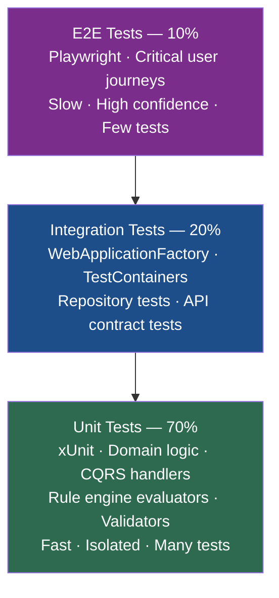
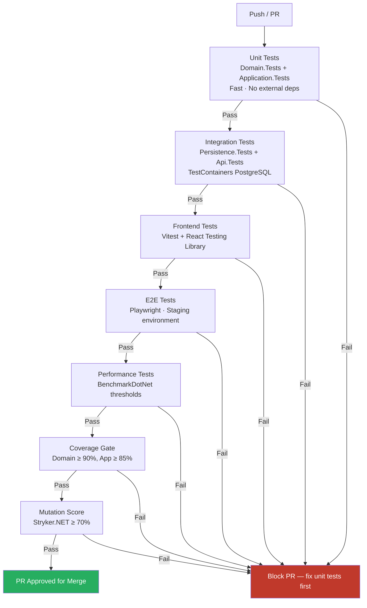

# Testing Handbook — Preferential Rules of Origin Calculation System

> Version: 1.0 | Last Updated: 2026-06-26 | Classification: Internal Engineering Reference

---

## Table of Contents

1. [Testing Philosophy](#1-testing-philosophy)
2. [Test Pyramid](#2-test-pyramid)
3. [Folder Structure](#3-folder-structure)
4. [Naming Conventions](#4-naming-conventions)
5. [Unit Testing](#5-unit-testing)
6. [CQRS Handler Testing](#6-cqrs-handler-testing)
7. [Validation Testing](#7-validation-testing)
8. [Rule Engine Testing](#8-rule-engine-testing)
9. [Origin Calculation Testing](#9-origin-calculation-testing)
10. [Integration Testing](#10-integration-testing)
11. [Repository Testing](#11-repository-testing)
12. [Middleware Testing](#12-middleware-testing)
13. [Authentication and Authorization Testing](#13-authentication-and-authorization-testing)
14. [API Integration Testing](#14-api-integration-testing)
15. [Frontend Component Testing](#15-frontend-component-testing)
16. [Hook Testing](#16-hook-testing)
17. [Accessibility Testing](#17-accessibility-testing)
18. [Playwright E2E Testing](#18-playwright-e2e-testing)
19. [Performance Testing](#19-performance-testing)
20. [Mutation Testing](#20-mutation-testing)
21. [Mocking Strategy](#21-mocking-strategy)
22. [Test Data — Builder Pattern](#22-test-data--builder-pattern)
23. [Coverage Requirements](#23-coverage-requirements)
24. [CI Pipeline Integration](#24-ci-pipeline-integration)
25. [Definition of Done](#25-definition-of-done)

---

## 1. Testing Philosophy

### Test Behavior, Not Implementation

Tests verify observable behavior from the perspective of the consumer of the code under test. Tests do not verify internal implementation details such as which private methods were called, in what order private fields were set, or whether a specific LINQ expression was used. If an implementation can be changed without breaking tests, the tests are written correctly.

**BAD** — tests implementation detail:
```csharp
// This breaks whenever internal refactoring occurs
Assert.Equal(3, handler._ruleSteps.Count);
```

**GOOD** — tests observable behavior:
```csharp
// This survives refactoring as long as the outcome is correct
result.Should().Be(OriginStatus.Originating);
result.EvaluationResults.Should().HaveCountGreaterThan(0);
```

### Tests Are Production Code

Test code is subject to the same quality standards as production code:

- No magic strings or magic numbers — use named constants and builders
- No copy-paste between test methods — extract shared setup into fixtures or helpers
- No commented-out tests — remove or fix
- No `Thread.Sleep` — use deterministic time injection instead
- No `Assert.True(x != null)` — use FluentAssertions for readable, precise assertions
- Tests must be maintained alongside the feature they cover; an outdated test is a liability

### One Assertion Concept Per Test

Each test method covers a single behavioral concern. A test that asserts ten different properties of a result is testing ten behaviors and will give an unhelpful failure message when one of them breaks.

**Preferred**: one logical assertion block per `[Fact]`, multiple related assertions within the same logical concept (e.g., verifying all fields of a returned DTO when the scenario is "returns correct data").

### Avoid Shared Mutable State

Test classes must not share mutable state between test methods. Use `IClassFixture<T>` only for expensive, read-only infrastructure (e.g., the TestContainers PostgreSQL fixture). Never store state in static fields used across tests.

---

## 2. Test Pyramid

The test suite follows a strict pyramid distribution to balance confidence, speed, and cost of maintenance.



| Layer | Coverage Target | Tool Stack | Execution Speed |
|---|---|---|---|
| Unit (70%) | Domain 90%, Application 85% | xUnit, NSubstitute, FluentAssertions | < 10 seconds |
| Integration (20%) | Infrastructure 70%, API 80% | xUnit, TestContainers, WebApplicationFactory | < 120 seconds |
| E2E (10%) | Critical paths only | Playwright, axe-core | < 10 minutes |

**Rule**: A failing unit test must be fixed before integration or E2E tests are run. The build pipeline gates each layer on the layer below it passing.

---

## 3. Folder Structure

Test projects mirror the source project they cover. Each test project is a separate `.csproj` under the `Tests/` folder at solution root.

```
Tests/
├── Domain.Tests/
│   ├── Aggregates/
│   │   ├── TradeAgreement/
│   │   │   └── TradeAgreementTests.cs
│   │   ├── OriginCalculation/
│   │   │   └── OriginCalculationTests.cs
│   │   └── FinishedProduct/
│   │       └── FinishedProductTests.cs
│   ├── ValueObjects/
│   │   ├── HSCodeValueTests.cs
│   │   ├── CountryCodeTests.cs
│   │   └── ValueThresholdTests.cs
│   └── Domain.Tests.csproj
│
├── Application.Tests/
│   ├── Features/
│   │   ├── TradeAgreements/
│   │   │   ├── Commands/
│   │   │   │   ├── CreateTradeAgreementCommandHandlerTests.cs
│   │   │   │   └── CreateTradeAgreementCommandValidatorTests.cs
│   │   │   └── Queries/
│   │   │       └── GetTradeAgreementByIdQueryHandlerTests.cs
│   │   ├── OriginCalculations/
│   │   │   ├── Commands/
│   │   │   │   └── CalculateOriginCommandHandlerTests.cs
│   │   │   └── Validators/
│   │   │       └── CalculateOriginCommandValidatorTests.cs
│   │   └── RuleDefinitions/
│   │       └── Commands/
│   │           └── UpdateRuleDefinitionCommandHandlerTests.cs
│   ├── Behaviors/
│   │   ├── ValidationBehaviorTests.cs
│   │   ├── AuthorizationBehaviorTests.cs
│   │   └── LoggingBehaviorTests.cs
│   └── Application.Tests.csproj
│
├── Infrastructure.Tests/
│   ├── Services/
│   │   ├── CurrentUserServiceTests.cs
│   │   ├── EmailServiceTests.cs
│   │   └── FileStorageServiceTests.cs
│   ├── ExternalApis/
│   │   └── TariffApiClientTests.cs
│   └── Infrastructure.Tests.csproj
│
├── Persistence.Tests/
│   ├── Fixtures/
│   │   └── PostgreSqlFixture.cs
│   ├── Repositories/
│   │   ├── TradeAgreementRepositoryTests.cs
│   │   ├── OriginCalculationRepositoryTests.cs
│   │   └── GenericRepositoryTests.cs
│   ├── Queries/
│   │   ├── TradeAgreementQueriesTests.cs
│   │   └── OriginCalculationQueriesTests.cs
│   └── Persistence.Tests.csproj
│
├── Api.Tests/
│   ├── Fixtures/
│   │   └── ApiWebApplicationFactory.cs
│   ├── Controllers/
│   │   ├── TradeAgreementControllerTests.cs
│   │   ├── OriginCalculationControllerTests.cs
│   │   └── AuthControllerTests.cs
│   ├── Middleware/
│   │   ├── ExceptionHandlingMiddlewareTests.cs
│   │   └── TenantResolutionMiddlewareTests.cs
│   └── Api.Tests.csproj
│
├── Frontend.Tests/
│   ├── components/
│   │   ├── TradeAgreementList.test.tsx
│   │   ├── OriginCalculationForm.test.tsx
│   │   └── RuleEvaluationResult.test.tsx
│   ├── hooks/
│   │   ├── useTradeAgreements.test.ts
│   │   └── useOriginCalculation.test.ts
│   ├── pages/
│   │   └── CalculationPage.test.tsx
│   └── package.json (vitest config)
│
├── E2E.Tests/
│   ├── pages/
│   │   ├── LoginPage.ts
│   │   ├── TradeAgreementPage.ts
│   │   └── OriginCalculationPage.ts
│   ├── specs/
│   │   ├── auth.spec.ts
│   │   ├── trade-agreements.spec.ts
│   │   └── origin-calculation.spec.ts
│   └── playwright.config.ts
│
├── Performance.Tests/
│   ├── RuleEngineBenchmarks.cs
│   ├── QueryBenchmarks.cs
│   └── Performance.Tests.csproj
│
└── Mutation.Tests/
    └── stryker-config.json
```

---

## 4. Naming Conventions

### Test Project Names

| Production Project | Test Project |
|---|---|
| `PraeferenzRoO.Domain` | `PraeferenzRoO.Domain.Tests` |
| `PraeferenzRoO.Application` | `PraeferenzRoO.Application.Tests` |
| `PraeferenzRoO.Infrastructure` | `PraeferenzRoO.Infrastructure.Tests` |
| `PraeferenzRoO.Persistence` | `PraeferenzRoO.Persistence.Tests` |
| `PraeferenzRoO.Api` | `PraeferenzRoO.Api.Tests` |

### Test Class Names

Test class names mirror the class under test with a `Tests` suffix:

| Class Under Test | Test Class |
|---|---|
| `CreateTradeAgreementCommandHandler` | `CreateTradeAgreementCommandHandlerTests` |
| `TradeAgreementRepository` | `TradeAgreementRepositoryTests` |
| `HSCodeValue` | `HSCodeValueTests` |
| `ValueAddedRule` | `ValueAddedRuleTests` |
| `ExceptionHandlingMiddleware` | `ExceptionHandlingMiddlewareTests` |

### Test Method Names

Pattern: `MethodName_StateUnderTest_ExpectedBehavior`

| Good | Bad |
|---|---|
| `Handle_ValidCommand_ReturnsCreatedId` | `TestHandleValid` |
| `Validate_EmptyName_ReturnsNameRequiredError` | `ShouldFailWhenNameIsEmpty` |
| `ExecuteAsync_NonOriginatingMaterialsExceedThreshold_ReturnsFail` | `TestValueAdded` |
| `GetByIdAsync_NonExistentId_ReturnsNull` | `TestGetById` |
| `AddProductRule_DuplicateHSCode_ThrowsDomainException` | `AddRuleFailTest` |

---

## 5. Unit Testing

### xUnit Facts and Theories

Use `[Fact]` for a single specific case. Use `[Theory]` with `[InlineData]` or `[MemberData]` for parameterized scenarios that share the same behavioral expectation with different inputs.

```csharp
// [Fact] — single scenario
[Fact]
public void Constructor_ValidHSCode_SetsCodeProperty()
{
    var hsCode = new HSCodeValue("8471300000");
    hsCode.Code.Should().Be("8471300000");
    hsCode.Chapter.Should().Be(84);
    hsCode.Heading.Should().Be(8471);
}

// [Theory] — multiple invalid inputs for same validation rule
[Theory]
[InlineData("")]
[InlineData("12345")]          // too short
[InlineData("ABCDEFGHIJ")]    // non-numeric
[InlineData("12345678901")]   // too long
public void Constructor_InvalidHSCode_ThrowsDomainException(string invalidCode)
{
    var act = () => new HSCodeValue(invalidCode);
    act.Should().Throw<DomainException>()
       .WithMessage($"*{invalidCode}*");
}
```

### Arrange-Act-Assert Structure

Every unit test must follow the three-section AAA layout, with blank lines separating each section. Inline comments mark sections only when the setup is non-trivial.

```csharp
[Fact]
public void AddProductRule_UniqueHSCode_AddsRuleAndRaisesEvent()
{
    // Arrange
    var agreement = TradeAgreementBuilder.Build();
    var rule = ProductRuleBuilder.WithHSCode("8471300000").Build();

    // Act
    agreement.AddProductRule(rule);

    // Assert
    agreement.ProductRules.Should().ContainSingle(r => r.HSCode.Code == "8471300000");
    agreement.DomainEvents.Should().ContainSingle(e => e is ProductRuleAddedEvent);
}
```

### Domain Object Tests

Domain tests cover:

- Aggregate root invariant enforcement (duplicate rule rejection, state transitions)
- Value object equality semantics and construction validation
- Domain event publication
- Business rule methods on entities

Never mock domain objects. Construct real instances using builders (see Section 22).

---

## 6. CQRS Handler Testing

### Command Handler Unit Tests

Command handlers are unit tested with mocked repository dependencies. The test verifies that the handler:

1. Calls the repository with the correct arguments
2. Returns the expected `Result<T>`
3. Does not bypass the domain model

**Example 1 — Unit test for `CreateTradeAgreementCommandHandler`:**

```csharp
using FluentAssertions;
using NSubstitute;
using PraeferenzRoO.Application.Features.TradeAgreements.Commands.CreateTradeAgreement;
using PraeferenzRoO.Domain.Aggregates.TradeAgreement;
using PraeferenzRoO.Domain.Interfaces;
using Xunit;

public class CreateTradeAgreementCommandHandlerTests
{
    [Fact]
    public async Task Handle_ValidCommand_ReturnsCreatedId()
    {
        // Arrange
        var repo = Substitute.For<ITradeAgreementRepository>();
        var handler = new CreateTradeAgreementCommandHandler(repo);
        var command = new CreateTradeAgreementCommand
        {
            Name = "EU-DE",
            CountryId = Guid.NewGuid(),
            EffectiveDate = DateOnly.FromDateTime(DateTime.UtcNow)
        };
        repo.AddAsync(Arg.Any<TradeAgreement>(), Arg.Any<CancellationToken>())
            .Returns(Guid.NewGuid());

        // Act
        var result = await handler.Handle(command, CancellationToken.None);

        // Assert
        result.Should().NotBeEmpty();
        await repo.Received(1).AddAsync(Arg.Any<TradeAgreement>(), Arg.Any<CancellationToken>());
    }

    [Fact]
    public async Task Handle_ValidCommand_PassesThroughCancellationToken()
    {
        // Arrange
        var repo = Substitute.For<ITradeAgreementRepository>();
        var handler = new CreateTradeAgreementCommandHandler(repo);
        var command = new CreateTradeAgreementCommand
        {
            Name = "EU-JP",
            CountryId = Guid.NewGuid(),
            EffectiveDate = DateOnly.FromDateTime(DateTime.UtcNow)
        };
        using var cts = new CancellationTokenSource();

        // Act
        await handler.Handle(command, cts.Token);

        // Assert — token propagated to repository
        await repo.Received(1).AddAsync(Arg.Any<TradeAgreement>(), cts.Token);
    }
}
```

### Query Handler Unit Tests

Query handlers that use Dapper are tested against a real PostgreSQL database via TestContainers (see Section 11). Query handlers that use simple repository calls are tested with mocked repositories.

```csharp
public class GetTradeAgreementByIdQueryHandlerTests
{
    [Fact]
    public async Task Handle_ExistingId_ReturnsAgreementDto()
    {
        // Arrange
        var expectedId = Guid.NewGuid();
        var repo = Substitute.For<ITradeAgreementRepository>();
        repo.GetByIdAsync(expectedId, Arg.Any<CancellationToken>())
            .Returns(TradeAgreementBuilder.WithId(expectedId).Build());

        var handler = new GetTradeAgreementByIdQueryHandler(repo);
        var query = new GetTradeAgreementByIdQuery { Id = expectedId };

        // Act
        var result = await handler.Handle(query, CancellationToken.None);

        // Assert
        result.IsSuccess.Should().BeTrue();
        result.Value!.Id.Should().Be(expectedId);
    }

    [Fact]
    public async Task Handle_NonExistentId_ReturnsNotFoundFailure()
    {
        // Arrange
        var repo = Substitute.For<ITradeAgreementRepository>();
        repo.GetByIdAsync(Arg.Any<Guid>(), Arg.Any<CancellationToken>())
            .Returns((TradeAgreement?)null);

        var handler = new GetTradeAgreementByIdQueryHandler(repo);
        var query = new GetTradeAgreementByIdQuery { Id = Guid.NewGuid() };

        // Act
        var result = await handler.Handle(query, CancellationToken.None);

        // Assert
        result.IsSuccess.Should().BeFalse();
        result.Error.Code.Should().Be("NotFound");
    }
}
```

### What Handler Tests Must Not Do

- Must not verify EF Core change tracking internals (`.Entry()`, `.State`)
- Must not construct a real `DbContext` — that belongs in Persistence.Tests
- Must not set up HTTP context or middleware — that belongs in Api.Tests
- Must not test FluentValidation behavior inline — validators have their own test classes

---

## 7. Validation Testing

FluentValidation validators are tested using the official `FluentValidation.TestHelper` package. The `TestValidate()` extension method runs the validator synchronously and returns a `TestValidationResult<T>` for assertion.

**Example 2 — Validator theory with inline data:**

```csharp
using FluentValidation.TestHelper;
using PraeferenzRoO.Application.Features.TradeAgreements.Commands.CreateTradeAgreement;
using Xunit;

public class CreateTradeAgreementCommandValidatorTests
{
    private readonly CreateTradeAgreementCommandValidator _validator = new();

    [Theory]
    [InlineData("", "Name is required")]
    [InlineData(null, "Name is required")]
    public void Validate_EmptyName_ReturnsError(string? name, string expectedError)
    {
        // Arrange
        var command = new CreateTradeAgreementCommand { Name = name! };

        // Act
        var result = _validator.TestValidate(command);

        // Assert
        result.ShouldHaveValidationErrorFor(x => x.Name)
              .WithErrorMessage(expectedError);
    }

    [Fact]
    public void Validate_NameExceedsMaxLength_ReturnsError()
    {
        var command = new CreateTradeAgreementCommand { Name = new string('A', 201) };
        var result = _validator.TestValidate(command);
        result.ShouldHaveValidationErrorFor(x => x.Name);
    }

    [Fact]
    public void Validate_MissingCountryId_ReturnsError()
    {
        var command = new CreateTradeAgreementCommand
        {
            Name = "EU-DE",
            CountryId = Guid.Empty,
            EffectiveDate = DateOnly.FromDateTime(DateTime.UtcNow)
        };
        var result = _validator.TestValidate(command);
        result.ShouldHaveValidationErrorFor(x => x.CountryId);
    }

    [Fact]
    public void Validate_ValidCommand_PassesWithoutErrors()
    {
        var command = new CreateTradeAgreementCommand
        {
            Name = "EU-JP",
            CountryId = Guid.NewGuid(),
            EffectiveDate = DateOnly.FromDateTime(DateTime.UtcNow)
        };
        var result = _validator.TestValidate(command);
        result.ShouldNotHaveAnyValidationErrors();
    }
}
```

### Validation Test Requirements

- Test both the presence of a validation error for invalid input and the absence for valid input
- Assert the exact error message using `WithErrorMessage()` — this catches copy-paste errors in error messages
- For `[Theory]`, each `[InlineData]` row is a documented business rule, not just a code path
- Async validators (e.g., uniqueness checks hitting the database) are tested in Integration.Tests with a real repository

---

## 8. Rule Engine Testing

### Testing Individual Rule Evaluators

Each `IRule` implementation is tested in isolation with a manually constructed `RuleContext`. Tests cover both the pass case and the fail case for the specific condition the rule enforces.

```csharp
public class ValueAddedRuleTests
{
    [Fact]
    public async Task ExecuteAsync_NonOriginatingBelowThreshold_ReturnsPass()
    {
        // Arrange — 30% non-originating, threshold is 40%
        var materials = new[]
        {
            MaterialBuilder.Originating().WithValuePercentage(70m).Build(),
            MaterialBuilder.NonOriginating().WithValuePercentage(30m).Build()
        };
        var context = RuleContextBuilder
            .WithMaterials(materials)
            .WithParameters(new ValueAddedParameters { MaxNonOriginatingPercentage = 40m })
            .Build();
        var rule = new ValueAddedRule();

        // Act
        var result = await rule.ExecuteAsync(context);

        // Assert
        result.IsPass.Should().BeTrue();
        result.RuleName.Should().Be("ValueAdded");
        result.FailureReason.Should().BeNull();
    }

    [Fact]
    public async Task ExecuteAsync_NonOriginatingExceedsThreshold_ReturnsFail()
    {
        // Arrange — 55% non-originating, threshold is 40%
        var materials = new[]
        {
            MaterialBuilder.Originating().WithValuePercentage(45m).Build(),
            MaterialBuilder.NonOriginating().WithValuePercentage(55m).Build()
        };
        var context = RuleContextBuilder
            .WithMaterials(materials)
            .WithParameters(new ValueAddedParameters { MaxNonOriginatingPercentage = 40m })
            .Build();
        var rule = new ValueAddedRule();

        // Act
        var result = await rule.ExecuteAsync(context);

        // Assert
        result.IsPass.Should().BeFalse();
        result.FailureReason.Should().Contain("55");
        result.FailureReason.Should().Contain("40");
    }

    [Fact]
    public async Task ExecuteAsync_ExactlyAtThreshold_ReturnsPass()
    {
        // Arrange — boundary: exactly at threshold is a pass
        var materials = new[]
        {
            MaterialBuilder.Originating().WithValuePercentage(60m).Build(),
            MaterialBuilder.NonOriginating().WithValuePercentage(40m).Build()
        };
        var context = RuleContextBuilder
            .WithMaterials(materials)
            .WithParameters(new ValueAddedParameters { MaxNonOriginatingPercentage = 40m })
            .Build();
        var rule = new ValueAddedRule();

        // Act
        var result = await rule.ExecuteAsync(context);

        // Assert
        result.IsPass.Should().BeTrue("exactly at threshold is a passing case per EU treaty interpretation");
    }
}
```

### Testing Rule Pipeline Composition

The pipeline is tested by running multiple rules in sequence and verifying that a failing rule short-circuits execution and a passing pipeline produces `Originating`.

```csharp
public class RuleEngineServiceTests
{
    [Fact]
    public async Task ExecuteAsync_AllRulesPass_ReturnsOriginatingStatus()
    {
        // Arrange
        var rule1 = Substitute.For<IRule>();
        var rule2 = Substitute.For<IRule>();
        rule1.ExecuteAsync(Arg.Any<RuleContext>()).Returns(RuleResult.Pass("TariffShift"));
        rule2.ExecuteAsync(Arg.Any<RuleContext>()).Returns(RuleResult.Pass("ValueAdded"));

        var factory = Substitute.For<IRuleFactory>();
        factory.CreateRules(Arg.Any<IEnumerable<RuleDefinition>>())
               .Returns(new[] { rule1, rule2 });

        var service = new RuleEngineService(factory);
        var context = RuleContextBuilder.Default().Build();

        // Act
        var calculation = await service.ExecuteAsync(context, CancellationToken.None);

        // Assert
        calculation.Status.Should().Be(OriginStatus.Originating);
        calculation.EvaluationResults.Should().HaveCount(2);
    }

    [Fact]
    public async Task ExecuteAsync_FirstRuleFails_ShortCircuitsRemainingRules()
    {
        // Arrange
        var rule1 = Substitute.For<IRule>();
        var rule2 = Substitute.For<IRule>();
        rule1.ExecuteAsync(Arg.Any<RuleContext>())
             .Returns(RuleResult.Fail("TariffShift", "Chapter change not achieved"));
        rule2.ExecuteAsync(Arg.Any<RuleContext>())
             .Returns(RuleResult.Pass("ValueAdded"));

        var factory = Substitute.For<IRuleFactory>();
        factory.CreateRules(Arg.Any<IEnumerable<RuleDefinition>>())
               .Returns(new[] { rule1, rule2 });

        var service = new RuleEngineService(factory);
        var context = RuleContextBuilder.Default().Build();

        // Act
        var calculation = await service.ExecuteAsync(context, CancellationToken.None);

        // Assert
        calculation.Status.Should().Be(OriginStatus.NonOriginating);
        await rule2.DidNotReceive().ExecuteAsync(Arg.Any<RuleContext>());
    }
}
```

### Testing Metadata-Driven Rule Loading

Rules are loaded from database `RuleDefinition` records. Tests verify the factory correctly maps `ImplementingClass` values to concrete `IRule` instances.

```csharp
public class RuleFactoryTests
{
    [Theory]
    [InlineData("TariffShiftRule", typeof(TariffShiftRule))]
    [InlineData("ValueAddedRule", typeof(ValueAddedRule))]
    [InlineData("WhollyObtainedRule", typeof(WhollyObtainedRule))]
    [InlineData("SpecificProcessRule", typeof(SpecificProcessRule))]
    public void CreateRules_KnownRuleType_ReturnsCorrectImplementation(
        string implementingClass, Type expectedType)
    {
        // Arrange
        var definition = RuleDefinitionBuilder
            .WithImplementingClass(implementingClass)
            .Build();
        var factory = new RuleFactory();

        // Act
        var rules = factory.CreateRules(new[] { definition });

        // Assert
        rules.Should().ContainSingle().Which.Should().BeOfType(expectedType);
    }

    [Fact]
    public void CreateRules_UnknownImplementingClass_ThrowsDomainException()
    {
        // Arrange
        var definition = RuleDefinitionBuilder
            .WithImplementingClass("NonExistentRule")
            .Build();
        var factory = new RuleFactory();

        // Act
        var act = () => factory.CreateRules(new[] { definition });

        // Assert
        act.Should().Throw<DomainException>()
           .WithMessage("*NonExistentRule*");
    }
}
```

---

## 9. Origin Calculation Testing

### End-to-End Calculation Flow

The origin calculation flow is tested against the `CalculateOriginCommandHandler` with a mocked rule engine service. This confirms that the handler correctly orchestrates product loading, rule engine execution, persisting the result, and raising the domain event — without depending on any specific rule logic.

```csharp
public class CalculateOriginCommandHandlerTests
{
    [Fact]
    public async Task Handle_OriginatingProduct_PersistsOriginatingCalculation()
    {
        // Arrange
        var productId = Guid.NewGuid();
        var agreementId = Guid.NewGuid();
        var product = FinishedProductBuilder.WithId(productId).Build();

        var ruleEngine = Substitute.For<IRuleEngineService>();
        ruleEngine.ExecuteAsync(product, agreementId, Arg.Any<CancellationToken>())
                  .Returns(OriginCalculationBuilder
                      .WithStatus(OriginStatus.Originating)
                      .Build());

        var repo = Substitute.For<IOriginCalculationRepository>();
        repo.GetFinishedProductAsync(productId, Arg.Any<CancellationToken>())
            .Returns(product);

        var unitOfWork = Substitute.For<IUnitOfWork>();
        var mapper = MapperFactory.Create();
        var handler = new CalculateOriginCommandHandler(repo, unitOfWork, ruleEngine, mapper);

        var command = new CalculateOriginCommand
        {
            FinishedProductId = productId,
            TradeAgreementId = agreementId
        };

        // Act
        var result = await handler.Handle(command, CancellationToken.None);

        // Assert
        result.IsSuccess.Should().BeTrue();
        result.Value!.Status.Should().Be("Originating");
        await repo.Received(1).AddAsync(
            Arg.Is<OriginCalculation>(c => c.Status == OriginStatus.Originating),
            Arg.Any<CancellationToken>());
        await unitOfWork.Received(1).SaveChangesAsync(Arg.Any<CancellationToken>());
    }

    [Fact]
    public async Task Handle_ProductNotFound_ReturnsNotFoundFailure()
    {
        // Arrange
        var repo = Substitute.For<IOriginCalculationRepository>();
        repo.GetFinishedProductAsync(Arg.Any<Guid>(), Arg.Any<CancellationToken>())
            .Returns((FinishedProduct?)null);

        var handler = new CalculateOriginCommandHandler(
            repo,
            Substitute.For<IUnitOfWork>(),
            Substitute.For<IRuleEngineService>(),
            MapperFactory.Create());

        var command = new CalculateOriginCommand
        {
            FinishedProductId = Guid.NewGuid(),
            TradeAgreementId = Guid.NewGuid()
        };

        // Act
        var result = await handler.Handle(command, CancellationToken.None);

        // Assert
        result.IsSuccess.Should().BeFalse();
        result.Error.Code.Should().Be("NotFound");
    }

    [Fact]
    public async Task Handle_CompletedCalculation_RaisesOriginCalculationCompletedEvent()
    {
        // Arrange
        var product = FinishedProductBuilder.Build();
        var calculation = OriginCalculationBuilder
            .WithStatus(OriginStatus.Originating)
            .Build();

        var ruleEngine = Substitute.For<IRuleEngineService>();
        ruleEngine.ExecuteAsync(Arg.Any<FinishedProduct>(), Arg.Any<Guid>(), Arg.Any<CancellationToken>())
                  .Returns(calculation);

        var repo = Substitute.For<IOriginCalculationRepository>();
        repo.GetFinishedProductAsync(Arg.Any<Guid>(), Arg.Any<CancellationToken>())
            .Returns(product);

        var handler = new CalculateOriginCommandHandler(
            repo,
            Substitute.For<IUnitOfWork>(),
            ruleEngine,
            MapperFactory.Create());

        // Act
        await handler.Handle(new CalculateOriginCommand
        {
            FinishedProductId = product.Id,
            TradeAgreementId = Guid.NewGuid()
        }, CancellationToken.None);

        // Assert
        calculation.DomainEvents.Should()
            .ContainSingle(e => e is OriginCalculationCompletedEvent);
    }
}
```

---

## 10. Integration Testing

### WebApplicationFactory Setup

The API integration test fixture uses `WebApplicationFactory<Program>` to spin up the full ASP.NET Core pipeline in-process. The fixture overrides services to replace production dependencies with test doubles or TestContainers instances.

```csharp
public class ApiWebApplicationFactory : WebApplicationFactory<Program>
{
    private static readonly PostgreSqlContainer _pgContainer =
        new PostgreSqlBuilder()
            .WithDatabase("praeferenz_test")
            .WithUsername("test")
            .WithPassword("test")
            .Build();

    public static async Task InitializeAsync()
        => await _pgContainer.StartAsync();

    protected override void ConfigureWebHost(IWebHostBuilder builder)
    {
        builder.ConfigureTestServices(services =>
        {
            // Replace production PostgreSQL connection with TestContainers connection
            services.RemoveAll<DbContextOptions<ApplicationDbContext>>();
            services.AddDbContext<ApplicationDbContext>(opts =>
                opts.UseNpgsql(_pgContainer.GetConnectionString()));

            // Replace ICurrentUserService with a fixed test user
            services.RemoveAll<ICurrentUserService>();
            services.AddSingleton<ICurrentUserService, TestCurrentUserService>();
        });
    }

    public static async Task DisposeAsync()
        => await _pgContainer.DisposeAsync();
}
```

### Database Seeding Strategy

Each integration test that requires database state seeds its own data and cleans up after itself. Never rely on shared database state between tests.

```csharp
public class TradeAgreementControllerTests : IClassFixture<ApiWebApplicationFactory>
{
    private readonly HttpClient _client;
    private readonly ApplicationDbContext _db;

    public TradeAgreementControllerTests(ApiWebApplicationFactory factory)
    {
        _client = factory.CreateClient();
        _db = factory.Services.GetRequiredService<ApplicationDbContext>();
    }

    private async Task<TradeAgreement> SeedAgreementAsync()
    {
        var agreement = TradeAgreementBuilder.Build();
        _db.TradeAgreements.Add(agreement);
        await _db.SaveChangesAsync();
        return agreement;
    }

    private async Task CleanupAsync(Guid id)
    {
        var entity = await _db.TradeAgreements.FindAsync(id);
        if (entity is not null)
        {
            _db.TradeAgreements.Remove(entity);
            await _db.SaveChangesAsync();
        }
    }
}
```

---

## 11. Repository Testing

Repository tests use a **real PostgreSQL database** provisioned by TestContainers. SQLite in-memory is explicitly prohibited because it does not replicate PostgreSQL behavior (array types, JSON operators, row-level security, `ILIKE`, full-text search).

**Example 3 — Integration test for `TradeAgreementRepository`:**

```csharp
using FluentAssertions;
using PraeferenzRoO.Domain.Aggregates.TradeAgreement;
using PraeferenzRoO.Persistence.Repositories;
using Testcontainers.PostgreSql;
using Xunit;

public class PostgreSqlFixture : IAsyncLifetime
{
    public PostgreSqlContainer Container { get; } =
        new PostgreSqlBuilder()
            .WithDatabase("praeferenz_test")
            .WithUsername("test")
            .WithPassword("test")
            .Build();

    public string ConnectionString => Container.GetConnectionString();

    public async Task InitializeAsync()
    {
        await Container.StartAsync();
        // Apply migrations to test database
        await DatabaseMigrator.MigrateAsync(ConnectionString);
    }

    public async Task DisposeAsync()
        => await Container.DisposeAsync();
}

public class TradeAgreementRepositoryTests : IClassFixture<PostgreSqlFixture>
{
    private readonly TradeAgreementRepository _repository;
    private readonly ApplicationDbContext _dbContext;

    public TradeAgreementRepositoryTests(PostgreSqlFixture fixture)
    {
        var options = new DbContextOptionsBuilder<ApplicationDbContext>()
            .UseNpgsql(fixture.ConnectionString)
            .Options;
        _dbContext = new ApplicationDbContext(options);
        _repository = new TradeAgreementRepository(_dbContext);
    }

    [Fact]
    public async Task AddAsync_ValidEntity_PersistsToDatabase()
    {
        // Arrange
        var agreement = TradeAgreementBuilder
            .WithName("EU-CA CETA")
            .WithAgreementCode("EU-CA")
            .Build();

        // Act
        var id = await _repository.AddAsync(agreement, CancellationToken.None);
        await _dbContext.SaveChangesAsync();

        // Assert
        var persisted = await _repository.GetByIdAsync(id, CancellationToken.None);
        persisted.Should().NotBeNull();
        persisted!.Name.Should().Be("EU-CA CETA");
        persisted.AgreementCode.Should().Be("EU-CA");
    }

    [Fact]
    public async Task GetByCodeAsync_ExistingCode_ReturnsAgreement()
    {
        // Arrange
        var tenantId = Guid.NewGuid();
        var agreement = TradeAgreementBuilder
            .WithAgreementCode("EU-JP")
            .WithTenantId(tenantId)
            .Build();
        await _repository.AddAsync(agreement, CancellationToken.None);
        await _dbContext.SaveChangesAsync();

        // Act
        var result = await _repository.GetByCodeAsync("EU-JP", tenantId, CancellationToken.None);

        // Assert
        result.Should().NotBeNull();
        result!.AgreementCode.Should().Be("EU-JP");
    }

    [Fact]
    public async Task GetByCodeAsync_WrongTenantId_ReturnsNull()
    {
        // Arrange — agreement exists for tenant A
        var tenantA = Guid.NewGuid();
        var tenantB = Guid.NewGuid();
        var agreement = TradeAgreementBuilder
            .WithAgreementCode("EU-KR")
            .WithTenantId(tenantA)
            .Build();
        await _repository.AddAsync(agreement, CancellationToken.None);
        await _dbContext.SaveChangesAsync();

        // Act — query with tenant B
        var result = await _repository.GetByCodeAsync("EU-KR", tenantB, CancellationToken.None);

        // Assert — must not leak across tenant boundary
        result.Should().BeNull("tenant isolation must prevent cross-tenant data access");
    }

    [Fact]
    public async Task GetActiveAgreementsAsync_FiltersExpiredAgreements_ReturnsOnlyActive()
    {
        // Arrange
        var tenantId = Guid.NewGuid();
        var active = TradeAgreementBuilder.Active().WithTenantId(tenantId).Build();
        var expired = TradeAgreementBuilder.Expired().WithTenantId(tenantId).Build();
        await _repository.AddAsync(active, CancellationToken.None);
        await _repository.AddAsync(expired, CancellationToken.None);
        await _dbContext.SaveChangesAsync();

        // Act
        var results = await _repository.GetActiveAgreementsAsync(tenantId, CancellationToken.None);

        // Assert
        results.Should().ContainSingle(a => a.Id == active.Id);
        results.Should().NotContain(a => a.Id == expired.Id);
    }
}
```

---

## 12. Middleware Testing

### Exception Handling Middleware

```csharp
public class ExceptionHandlingMiddlewareTests
{
    [Fact]
    public async Task InvokeAsync_NotFoundException_Returns404WithProblemDetails()
    {
        // Arrange
        var logger = Substitute.For<ILogger<ExceptionHandlingMiddleware>>();
        var middleware = new ExceptionHandlingMiddleware(
            _ => throw new NotFoundException("Trade agreement not found"),
            logger);

        var context = new DefaultHttpContext();
        context.Response.Body = new MemoryStream();

        // Act
        await middleware.InvokeAsync(context);

        // Assert
        context.Response.StatusCode.Should().Be(404);
        context.Response.Body.Seek(0, SeekOrigin.Begin);
        var body = await new StreamReader(context.Response.Body).ReadToEndAsync();
        body.Should().Contain("Trade agreement not found");
    }

    [Fact]
    public async Task InvokeAsync_UnhandledException_Returns500AndLogsError()
    {
        // Arrange
        var logger = Substitute.For<ILogger<ExceptionHandlingMiddleware>>();
        var middleware = new ExceptionHandlingMiddleware(
            _ => throw new InvalidOperationException("Unexpected failure"),
            logger);

        var context = new DefaultHttpContext();
        context.Response.Body = new MemoryStream();

        // Act
        await middleware.InvokeAsync(context);

        // Assert
        context.Response.StatusCode.Should().Be(500);
        logger.Received(1).Log(
            LogLevel.Error,
            Arg.Any<EventId>(),
            Arg.Is<object>(o => o.ToString()!.Contains("Unexpected failure")),
            Arg.Any<Exception>(),
            Arg.Any<Func<object, Exception?, string>>());
    }
}
```

### Tenant Resolution Middleware

```csharp
public class TenantResolutionMiddlewareTests
{
    [Fact]
    public async Task InvokeAsync_ValidTenantClaim_SetsCurrentTenant()
    {
        // Arrange
        var tenantId = Guid.NewGuid();
        var tenantService = Substitute.For<ITenantService>();

        var nextCalled = false;
        var middleware = new TenantResolutionMiddleware(_ =>
        {
            nextCalled = true;
            return Task.CompletedTask;
        });

        var context = new DefaultHttpContext();
        context.User = ClaimsPrincipalFactory.WithTenantId(tenantId);

        // Act
        await middleware.InvokeAsync(context, tenantService);

        // Assert
        nextCalled.Should().BeTrue();
        tenantService.Received(1).SetCurrentTenant(tenantId);
    }

    [Fact]
    public async Task InvokeAsync_MissingTenantClaim_Returns401AndSkipsNext()
    {
        // Arrange
        var tenantService = Substitute.For<ITenantService>();
        var nextCalled = false;
        var middleware = new TenantResolutionMiddleware(_ =>
        {
            nextCalled = true;
            return Task.CompletedTask;
        });

        var context = new DefaultHttpContext();
        context.Response.Body = new MemoryStream();
        context.User = new ClaimsPrincipal(); // no claims

        // Act
        await middleware.InvokeAsync(context, tenantService);

        // Assert
        context.Response.StatusCode.Should().Be(401);
        nextCalled.Should().BeFalse();
    }
}
```

---

## 13. Authentication and Authorization Testing

### JWT Generation and Validation

```csharp
public class TokenServiceTests
{
    [Fact]
    public void GenerateAccessToken_ValidUser_ProducesValidJwt()
    {
        // Arrange
        var settings = new JwtSettings
        {
            Secret = "super-secret-key-at-least-32-characters",
            Issuer = "praeferenz-api",
            Audience = "praeferenz-client",
            AccessTokenExpiryMinutes = 15
        };
        var service = new TokenService(Options.Create(settings));
        var user = UserBuilder.WithRole("Operator").Build();

        // Act
        var token = service.GenerateAccessToken(user, user.TenantId, new[] { "Operator" });

        // Assert
        var handler = new JwtSecurityTokenHandler();
        var jwt = handler.ReadJwtToken(token);
        jwt.Claims.Should().Contain(c => c.Type == "tenant_id" && c.Value == user.TenantId.ToString());
        jwt.Claims.Should().Contain(c => c.Type == "roles" && c.Value == "Operator");
        jwt.ValidTo.Should().BeAfter(DateTime.UtcNow);
    }

    [Fact]
    public void GenerateRefreshToken_ReturnsOpaqueNonDeterministicToken()
    {
        // Arrange
        var service = new TokenService(Options.Create(JwtSettingsFactory.Default()));

        // Act
        var token1 = service.GenerateRefreshToken();
        var token2 = service.GenerateRefreshToken();

        // Assert
        token1.Should().NotBe(token2);
        token1.Length.Should().BeGreaterOrEqualTo(32);
    }
}
```

### Authorization Behavior Tests

```csharp
public class AuthorizationBehaviorTests
{
    [Fact]
    public async Task Handle_UserLacksRequiredRole_ThrowsUnauthorizedException()
    {
        // Arrange
        var currentUser = Substitute.For<ICurrentUserService>();
        currentUser.Roles.Returns(new[] { "Viewer" }); // not Admin or Operator

        var behavior = new AuthorizationBehavior<UpdateRuleDefinitionCommand, Result>(currentUser);
        var command = new UpdateRuleDefinitionCommand();

        // Act
        var act = async () => await behavior.Handle(command, () => Task.FromResult(Result.Success()), CancellationToken.None);

        // Assert
        await act.Should().ThrowAsync<UnauthorizedException>()
            .WithMessage("*Insufficient permissions*");
    }

    [Theory]
    [InlineData("Admin")]
    [InlineData("Operator")]
    public async Task Handle_UserHasRequiredRole_CallsNext(string role)
    {
        // Arrange
        var currentUser = Substitute.For<ICurrentUserService>();
        currentUser.Roles.Returns(new[] { role });

        var behavior = new AuthorizationBehavior<UpdateRuleDefinitionCommand, Result>(currentUser);
        var command = new UpdateRuleDefinitionCommand();
        var nextCalled = false;

        // Act
        await behavior.Handle(command, () =>
        {
            nextCalled = true;
            return Task.FromResult(Result.Success());
        }, CancellationToken.None);

        // Assert
        nextCalled.Should().BeTrue();
    }
}
```

---

## 14. API Integration Testing

### Response Envelope Verification

All API tests verify the `ApiResponse<T>` envelope shape, not just the raw HTTP status code.

```csharp
public class TradeAgreementControllerTests : IClassFixture<ApiWebApplicationFactory>
{
    private readonly HttpClient _client;

    public TradeAgreementControllerTests(ApiWebApplicationFactory factory)
    {
        _client = factory.CreateAuthenticatedClient(role: "Operator");
    }

    [Fact]
    public async Task GetById_ExistingAgreement_Returns200WithCorrectEnvelope()
    {
        // Arrange
        var id = await SeedAgreementAsync("EU-TW");

        // Act
        var response = await _client.GetAsync($"/api/trade-agreements/{id}");

        // Assert
        response.StatusCode.Should().Be(HttpStatusCode.OK);
        var body = await response.Content.ReadFromJsonAsync<ApiResponse<TradeAgreementDetailDto>>();
        body!.Success.Should().BeTrue();
        body.Data!.Id.Should().Be(id);
        body.Data.Name.Should().Be("EU-TW");
    }

    [Fact]
    public async Task GetById_NonExistentAgreement_Returns404WithErrorEnvelope()
    {
        // Act
        var response = await _client.GetAsync($"/api/trade-agreements/{Guid.NewGuid()}");

        // Assert
        response.StatusCode.Should().Be(HttpStatusCode.NotFound);
        var body = await response.Content.ReadFromJsonAsync<ApiResponse<object>>();
        body!.Success.Should().BeFalse();
        body.Message.Should().NotBeNullOrEmpty();
    }

    [Fact]
    public async Task CreateTradeAgreement_InvalidPayload_Returns422WithValidationErrors()
    {
        // Arrange
        var payload = new { Name = "" }; // missing required fields

        // Act
        var response = await _client.PostAsJsonAsync("/api/trade-agreements", payload);

        // Assert
        response.StatusCode.Should().Be(HttpStatusCode.UnprocessableEntity);
        var body = await response.Content.ReadFromJsonAsync<ApiResponse<object>>();
        body!.Success.Should().BeFalse();
        body.Errors.Should().NotBeEmpty();
    }

    [Fact]
    public async Task CreateTradeAgreement_UnauthenticatedRequest_Returns401()
    {
        // Arrange — use unauthenticated client
        var unauthClient = new HttpClient(); // no bearer token

        // Act
        var response = await unauthClient.PostAsJsonAsync("/api/trade-agreements", new { });

        // Assert
        response.StatusCode.Should().Be(HttpStatusCode.Unauthorized);
    }
}
```

---

## 15. Frontend Component Testing

### Vitest and React Testing Library

Frontend tests use Vitest as the test runner and React Testing Library for component rendering. Tests interact with components the way a user would — through accessible roles, labels, and text — never through CSS classes or component props directly.

```tsx
// TradeAgreementList.test.tsx
import { render, screen, waitFor } from '@testing-library/react';
import userEvent from '@testing-library/user-event';
import { describe, it, expect, vi } from 'vitest';
import { TradeAgreementList } from '../components/TradeAgreementList';

const mockAgreements = [
  { id: '1', name: 'EU-Japan EPA', agreementCode: 'EU-JP', status: 'Active' },
  { id: '2', name: 'EU-Canada CETA', agreementCode: 'EU-CA', status: 'Active' },
];

describe('TradeAgreementList', () => {
  it('renders a list of agreements', async () => {
    render(<TradeAgreementList agreements={mockAgreements} isLoading={false} />);

    expect(screen.getByText('EU-Japan EPA')).toBeInTheDocument();
    expect(screen.getByText('EU-Canada CETA')).toBeInTheDocument();
  });

  it('shows a loading skeleton when isLoading is true', () => {
    render(<TradeAgreementList agreements={[]} isLoading={true} />);

    expect(screen.getByRole('status', { name: /loading/i })).toBeInTheDocument();
    expect(screen.queryByText('EU-Japan EPA')).not.toBeInTheDocument();
  });

  it('shows empty state message when no agreements exist', () => {
    render(<TradeAgreementList agreements={[]} isLoading={false} />);

    expect(screen.getByText(/no trade agreements/i)).toBeInTheDocument();
  });

  it('calls onDelete when delete button is clicked and confirmed', async () => {
    const onDelete = vi.fn();
    const user = userEvent.setup();

    render(
      <TradeAgreementList
        agreements={mockAgreements}
        isLoading={false}
        onDelete={onDelete}
      />
    );

    await user.click(screen.getAllByRole('button', { name: /delete/i })[0]);
    await user.click(screen.getByRole('button', { name: /confirm/i }));

    expect(onDelete).toHaveBeenCalledWith('1');
  });
});
```

### Component Testing Rules

- Query by accessible role first (`getByRole`), then label (`getByLabelText`), then text (`getByText`)
- Never query by `data-testid` unless the element has no accessible role or label
- Never assert on CSS classes or component prop values — assert on what the user sees
- Async UI changes: use `waitFor` or `findBy*` queries; never `setTimeout`

---

## 16. Hook Testing

Custom React hooks are tested using `renderHook` from React Testing Library with a wrapper that provides the required context providers.

```tsx
// useTradeAgreements.test.ts
import { renderHook, act, waitFor } from '@testing-library/react';
import { describe, it, expect, vi, beforeEach } from 'vitest';
import { useTradeAgreements } from '../hooks/useTradeAgreements';
import { QueryClientProvider } from '@tanstack/react-query';
import { createTestQueryClient } from '../test-utils/queryClient';

vi.mock('../api/tradeAgreementsApi');
import * as tradeAgreementsApi from '../api/tradeAgreementsApi';

const wrapper = ({ children }: { children: React.ReactNode }) => (
  <QueryClientProvider client={createTestQueryClient()}>
    {children}
  </QueryClientProvider>
);

describe('useTradeAgreements', () => {
  beforeEach(() => {
    vi.resetAllMocks();
  });

  it('returns agreements when fetch succeeds', async () => {
    vi.mocked(tradeAgreementsApi.getTradeAgreements).mockResolvedValue([
      { id: '1', name: 'EU-JP', agreementCode: 'EU-JP' },
    ]);

    const { result } = renderHook(() => useTradeAgreements(), { wrapper });

    await waitFor(() => expect(result.current.isLoading).toBe(false));

    expect(result.current.agreements).toHaveLength(1);
    expect(result.current.agreements[0].name).toBe('EU-JP');
  });

  it('returns error state when fetch fails', async () => {
    vi.mocked(tradeAgreementsApi.getTradeAgreements).mockRejectedValue(
      new Error('Network error')
    );

    const { result } = renderHook(() => useTradeAgreements(), { wrapper });

    await waitFor(() => expect(result.current.isError).toBe(true));

    expect(result.current.error?.message).toContain('Network error');
  });
});
```

---

## 17. Accessibility Testing

### axe-core in Playwright

Every Playwright E2E test runs an accessibility audit via `@axe-core/playwright` on page load and after major state changes. The baseline is WCAG 2.1 AA.

```typescript
// accessibility.spec.ts
import { test, expect } from '@playwright/test';
import AxeBuilder from '@axe-core/playwright';

test.describe('Accessibility — Trade Agreement pages', () => {
  test('Trade agreements list page passes WCAG 2.1 AA', async ({ page }) => {
    await page.goto('/trade-agreements');

    const results = await new AxeBuilder({ page })
      .withTags(['wcag2a', 'wcag2aa', 'wcag21aa'])
      .analyze();

    expect(results.violations).toHaveLength(0);
  });

  test('Origin calculation form passes WCAG 2.1 AA', async ({ page }) => {
    await page.goto('/calculations/new');

    const results = await new AxeBuilder({ page })
      .withTags(['wcag2a', 'wcag2aa', 'wcag21aa'])
      .analyze();

    expect(results.violations).toHaveLength(0);
  });
});
```

### Vitest Accessibility Assertions

Component tests use `jest-axe` (Vitest-compatible) for unit-level a11y checks:

```tsx
import { render } from '@testing-library/react';
import { axe, toHaveNoViolations } from 'jest-axe';
import { expect } from 'vitest';

expect.extend(toHaveNoViolations);

it('OriginCalculationForm has no accessibility violations', async () => {
  const { container } = render(<OriginCalculationForm onSubmit={vi.fn()} />);
  const results = await axe(container);
  expect(results).toHaveNoViolations();
});
```

---

## 18. Playwright E2E Testing

### Page Object Model Pattern

All Playwright tests use the Page Object Model (POM) pattern. Never put Playwright selectors inline in test specs — they belong in page classes.

```typescript
// pages/OriginCalculationPage.ts
import { Page, Locator } from '@playwright/test';

export class OriginCalculationPage {
  private readonly page: Page;
  readonly heading: Locator;
  readonly productCodeInput: Locator;
  readonly agreementSelect: Locator;
  readonly calculateButton: Locator;
  readonly resultBadge: Locator;

  constructor(page: Page) {
    this.page = page;
    this.heading = page.getByRole('heading', { name: /origin calculation/i });
    this.productCodeInput = page.getByLabel('Product Code');
    this.agreementSelect = page.getByLabel('Trade Agreement');
    this.calculateButton = page.getByRole('button', { name: /calculate origin/i });
    this.resultBadge = page.getByTestId('origin-result-badge');
  }

  async goto() {
    await this.page.goto('/calculations/new');
    await this.heading.waitFor();
  }

  async fillProductCode(code: string) {
    await this.productCodeInput.fill(code);
  }

  async selectAgreement(agreementName: string) {
    await this.agreementSelect.selectOption({ label: agreementName });
  }

  async calculate() {
    await this.calculateButton.click();
    await this.resultBadge.waitFor({ state: 'visible' });
  }

  async getResult(): Promise<string> {
    return await this.resultBadge.textContent() ?? '';
  }
}
```

### Critical User Journey Tests

```typescript
// specs/origin-calculation.spec.ts
import { test, expect } from '@playwright/test';
import { LoginPage } from '../pages/LoginPage';
import { OriginCalculationPage } from '../pages/OriginCalculationPage';

test.describe('Origin Calculation — critical user journeys', () => {
  test('Operator calculates origin for qualifying product', async ({ page }) => {
    // Arrange — log in as Operator
    const loginPage = new LoginPage(page);
    await loginPage.goto();
    await loginPage.login('operator@test.com', 'Test@1234');

    // Act
    const calcPage = new OriginCalculationPage(page);
    await calcPage.goto();
    await calcPage.fillProductCode('PRD-8471');
    await calcPage.selectAgreement('EU-Japan EPA');
    await calcPage.calculate();

    // Assert
    const result = await calcPage.getResult();
    expect(result).toMatch(/originating/i);
  });

  test('Viewer cannot access calculation form — redirected', async ({ page }) => {
    const loginPage = new LoginPage(page);
    await loginPage.goto();
    await loginPage.login('viewer@test.com', 'Test@1234');

    await page.goto('/calculations/new');
    await expect(page).toHaveURL(/access-denied|login/);
  });

  test('Form shows validation error for missing product code', async ({ page }) => {
    const loginPage = new LoginPage(page);
    await loginPage.goto();
    await loginPage.login('operator@test.com', 'Test@1234');

    const calcPage = new OriginCalculationPage(page);
    await calcPage.goto();
    await calcPage.calculateButton.click();

    await expect(page.getByText(/product code is required/i)).toBeVisible();
  });
});
```

---

## 19. Performance Testing

### BenchmarkDotNet for Critical Paths

```csharp
using BenchmarkDotNet.Attributes;
using BenchmarkDotNet.Running;

[MemoryDiagnoser]
[SimpleJob(RuntimeMoniker.Net90)]
public class RuleEngineBenchmarks
{
    private RuleEngineService _service = null!;
    private RuleContext _context = null!;

    [GlobalSetup]
    public void Setup()
    {
        _service = RuleEngineServiceFactory.CreateWithAllRules();
        _context = RuleContextBuilder
            .WithMaterials(BenchmarkMaterials.Generate(100))
            .Build();
    }

    [Benchmark(Baseline = true)]
    public async Task<OriginCalculation> SingleCalculation()
        => await _service.ExecuteAsync(_context, CancellationToken.None);

    [Benchmark]
    [Arguments(10)]
    [Arguments(50)]
    [Arguments(100)]
    public async Task ConcurrentCalculations(int concurrency)
    {
        var tasks = Enumerable.Range(0, concurrency)
            .Select(_ => _service.ExecuteAsync(_context, CancellationToken.None));
        await Task.WhenAll(tasks);
    }
}
```

Performance thresholds enforced by CI:

| Benchmark | Target | Fail Threshold |
|---|---|---|
| Single rule engine execution | < 5 ms | > 10 ms |
| 100-material BOM calculation | < 50 ms | > 100 ms |
| TradeAgreement Dapper query | < 2 ms | > 5 ms |
| Concurrent calculations (50) | < 200 ms | > 500 ms |

### k6 Load Testing

```javascript
// k6/load-test.js
import http from 'k6/http';
import { check, sleep } from 'k6';

export const options = {
  stages: [
    { duration: '30s', target: 20 },   // ramp up
    { duration: '1m', target: 20 },    // hold
    { duration: '10s', target: 0 },    // ramp down
  ],
  thresholds: {
    http_req_duration: ['p(95)<500'],  // 95th percentile under 500ms
    http_req_failed: ['rate<0.01'],    // less than 1% failures
  },
};

export default function () {
  const res = http.get('http://localhost:5000/api/trade-agreements', {
    headers: { Authorization: `Bearer ${__ENV.TEST_TOKEN}` },
  });

  check(res, {
    'status is 200': (r) => r.status === 200,
    'response time OK': (r) => r.timings.duration < 500,
  });

  sleep(1);
}
```

---

## 20. Mutation Testing

### Stryker.NET Configuration

Stryker.NET is used to verify that tests are genuinely sensitive to code changes (not merely achieving line coverage without meaningful assertions).

```json
// stryker-config.json
{
  "stryker-config": {
    "project": "PraeferenzRoO.Domain.csproj",
    "test-projects": ["../Tests/Domain.Tests/Domain.Tests.csproj"],
    "reporters": ["html", "json", "dashboard"],
    "threshold-high": 80,
    "threshold-low": 70,
    "threshold-break": 60,
    "mutate": [
      "src/Domain/**/*.cs",
      "src/Application/**/*.cs",
      "!src/**/*Migrations*",
      "!src/**/*Designer*"
    ],
    "excluded-mutations": [
      "StringLiteral"
    ]
  }
}
```

### Mutation Score Targets

| Layer | Minimum Mutation Score |
|---|---|
| Domain | 80% |
| Application (handlers) | 75% |
| Application (validators) | 80% |
| Rule Engine evaluators | 85% |

**Interpreting results**: A mutation that survives indicates either a missing test case or an assertion that does not actually verify the behavior the mutant changed. Surviving mutants must be investigated — they often reveal untested edge cases in business rules.

---

## 21. Mocking Strategy

### What to Mock

| Dependency | Mock? | Reason |
|---|---|---|
| `ITradeAgreementRepository` | Yes — in unit tests | Application boundary; real DB belongs in integration |
| `ICurrentUserService` | Yes | Cross-cutting concern; isolated test control |
| `IEmailService` | Yes | External infrastructure |
| `IRuleEngineService` | Yes — in handler tests | Engine tested separately in rule engine tests |
| `IRule` implementations | Yes — in pipeline tests | Individual rules tested independently |
| Domain entities | Never | Construct real domain objects using builders |
| `DbContext` | Never — use TestContainers | SQLite does not replicate PostgreSQL behavior |
| `MediatR.IMediator` | Rarely | Prefer testing handlers directly, not via MediatR |

### NSubstitute Patterns

```csharp
// Substituting an interface
var repo = Substitute.For<ITradeAgreementRepository>();

// Setting up a return value
repo.GetByIdAsync(Arg.Any<Guid>(), Arg.Any<CancellationToken>())
    .Returns(TradeAgreementBuilder.Build());

// Verifying a call was made exactly once
await repo.Received(1).AddAsync(Arg.Any<TradeAgreement>(), Arg.Any<CancellationToken>());

// Verifying a call was never made
await repo.DidNotReceive().DeleteAsync(Arg.Any<TradeAgreement>(), Arg.Any<CancellationToken>());

// Argument matching with conditions
await repo.Received(1).AddAsync(
    Arg.Is<TradeAgreement>(a => a.Name == "EU-JP" && a.TenantId == expectedTenantId),
    Arg.Any<CancellationToken>());
```

### Anti-Patterns to Avoid

- **Do not mock what you don't own**: Do not mock `HttpClient`, `ILogger`, or framework types. Use real instances or test-friendly wrappers.
- **Do not set up mocks that are never called**: Every mock setup should correspond to a verified call or a controlled return in the test.
- **Do not use Moq `It.IsAny<T>()` for all arguments**: Prefer `Arg.Is<T>(predicate)` to verify business-significant argument values.

---

## 22. Test Data — Builder Pattern

### Domain Object Builders

Every test project provides builder classes for domain aggregates. Builders supply sensible defaults so tests only specify what is relevant to the scenario under test.

```csharp
public class TradeAgreementBuilder
{
    private Guid _id = Guid.NewGuid();
    private string _name = "Test Agreement";
    private string _agreementCode = "EU-TEST";
    private Guid _tenantId = Guid.NewGuid();
    private DateTime _effectiveFrom = DateTime.UtcNow.AddYears(-1);
    private DateTime? _effectiveTo = null;

    public static TradeAgreementBuilder New() => new();
    public static TradeAgreement Build() => New().BuildInstance();

    public TradeAgreementBuilder WithId(Guid id) { _id = id; return this; }
    public TradeAgreementBuilder WithName(string name) { _name = name; return this; }
    public TradeAgreementBuilder WithAgreementCode(string code) { _agreementCode = code; return this; }
    public TradeAgreementBuilder WithTenantId(Guid tenantId) { _tenantId = tenantId; return this; }

    public static TradeAgreementBuilder Active() =>
        New().WithEffectiveDates(DateTime.UtcNow.AddYears(-1), null);

    public static TradeAgreementBuilder Expired() =>
        New().WithEffectiveDates(DateTime.UtcNow.AddYears(-3), DateTime.UtcNow.AddYears(-1));

    private TradeAgreementBuilder WithEffectiveDates(DateTime from, DateTime? to)
    {
        _effectiveFrom = from;
        _effectiveTo = to;
        return this;
    }

    public TradeAgreement BuildInstance()
    {
        // Use reflection or a test-accessible factory to set private setters
        return TradeAgreement.Reconstitute(_id, _name, _agreementCode, _tenantId, _effectiveFrom, _effectiveTo);
    }
}
```

### Builder Design Rules

- Builders live in a `TestHelpers/Builders/` folder shared across test projects via a `PraeferenzRoO.TestHelpers` project
- Default values must never be `null`, `Guid.Empty`, or zero unless the test specifically requires those values
- Builders are immutable — each `With*` method returns a new builder, not `this`
- Avoid `AutoFixture` for domain objects: domain object construction has business invariants; generated random data may violate them

---

## 23. Coverage Requirements

Coverage is measured per layer and enforced in CI. The overall minimum is 80% across all backend layers.

| Layer | Line Coverage Target | Branch Coverage Target |
|---|---|---|
| Domain | 90% | 85% |
| Application | 85% | 80% |
| Infrastructure | 70% | 65% |
| Persistence | 70% | 65% |
| WebApi | 80% | 75% |
| Frontend | 75% | 70% |

### Coverage Configuration

```xml
<!-- In each test .csproj -->
<PropertyGroup>
  <CollectCoverage>true</CollectCoverage>
  <CoverletOutputFormat>opencover</CoverletOutputFormat>
  <ExcludeByAttribute>GeneratedCodeAttribute,ExcludeFromCodeCoverageAttribute</ExcludeByAttribute>
  <Exclude>[*]*Migrations*,[*]*Designer*,[*]*.g.cs</Exclude>
</PropertyGroup>
```

### What Not to Cover

- EF Core migration files
- Auto-generated code (`*.g.cs`)
- `Program.cs` startup wiring (covered by integration tests, excluded from line coverage)
- DTOs with no behavior (plain data classes)

Coverage for these files is excluded via `[ExcludeFromCodeCoverage]` attributes or coverlet exclude patterns.

---

## 24. CI Pipeline Integration

### Test Stage Diagram



### GitHub Actions Test Job Snippet

```yaml
test-backend:
  runs-on: ubuntu-latest
  services:
    postgres:
      image: postgres:16-alpine
      env:
        POSTGRES_DB: praeferenz_test
        POSTGRES_USER: test
        POSTGRES_PASSWORD: test
      options: >-
        --health-cmd pg_isready
        --health-interval 10s
        --health-timeout 5s
        --health-retries 5
  steps:
    - uses: actions/checkout@v4
    - uses: actions/setup-dotnet@v4
      with:
        dotnet-version: '9.0.x'
    - name: Restore
      run: dotnet restore
    - name: Build
      run: dotnet build --no-restore -c Release
    - name: Unit Tests
      run: dotnet test Tests/Domain.Tests Tests/Application.Tests --no-build -c Release --collect:"XPlat Code Coverage"
    - name: Integration Tests
      run: dotnet test Tests/Persistence.Tests Tests/Api.Tests --no-build -c Release --collect:"XPlat Code Coverage"
      env:
        ConnectionStrings__DefaultConnection: "Host=localhost;Database=praeferenz_test;Username=test;Password=test"
    - name: Upload Coverage
      uses: codecov/codecov-action@v4
```

---

## 25. Definition of Done

A feature is not done until every item in this checklist passes. Items must be verified, not assumed.

### Test Execution

- [ ] All tests pass (`dotnet test` exits with code 0)
- [ ] No tests are skipped (`[Skip]` attribute) without a comment explaining why and a linked issue
- [ ] No tests are marked as `[Fact(Skip = "TODO")]`
- [ ] Test run time for unit tests is under 30 seconds
- [ ] Integration tests complete without flakiness across three consecutive runs

### Coverage

- [ ] Domain layer coverage >= 90%
- [ ] Application layer coverage >= 85%
- [ ] WebApi layer coverage >= 80%
- [ ] Frontend coverage >= 75%
- [ ] Coverage does not decrease compared to the base branch

### Test Quality

- [ ] All assertions use FluentAssertions — no bare `Assert.True`, `Assert.Equal`
- [ ] No shared mutable state between test methods (no static mutable fields)
- [ ] Every test follows the Arrange-Act-Assert pattern with blank-line section separation
- [ ] Test method names follow `MethodName_StateUnderTest_ExpectedBehavior`
- [ ] No `Thread.Sleep` or `Task.Delay` in tests without documented justification

### Unit Tests

- [ ] Every new command handler has a unit test covering the success path
- [ ] Every new command handler has a unit test covering the not-found / failure path
- [ ] Handler tests do not construct or reference `DbContext`, `EF Core` change tracker, or migrations
- [ ] Domain entity tests cover all business rule enforcement methods
- [ ] Value object tests cover construction validation and equality semantics

### Validation Tests

- [ ] Every new validator has tests for invalid inputs (at minimum: null, empty, boundary violations)
- [ ] Every new validator has a test confirming valid input passes without errors
- [ ] Validation tests use FluentValidation TestHelper (`TestValidate`, `ShouldHaveValidationErrorFor`)
- [ ] Exact error messages are asserted with `WithErrorMessage()`

### Rule Engine Tests

- [ ] Every IRule evaluator implementation has a unit test covering the pass scenario
- [ ] Every IRule evaluator implementation has a unit test covering the fail scenario
- [ ] Every IRule evaluator has a boundary test (at threshold, just above, just below)
- [ ] RuleFactory is tested for all registered `ImplementingClass` values
- [ ] Pipeline short-circuit behavior is tested

### Repository and Integration Tests

- [ ] Repository tests run against real PostgreSQL via TestContainers — not SQLite, not in-memory EF Core
- [ ] Multi-tenant isolation is tested: data seeded for tenant A must not be visible to tenant B
- [ ] Soft-delete behavior is tested: deleted records are excluded from standard queries

### API Tests

- [ ] API tests verify the full `ApiResponse<T>` envelope shape, not only HTTP status
- [ ] API tests cover the 401 (unauthenticated) and 403 (insufficient role) paths
- [ ] API tests cover the 422 (validation failure) path for every create/update endpoint

### Frontend and E2E Tests

- [ ] E2E tests for new user journeys use the Page Object Model pattern
- [ ] No Playwright selectors are written inline in spec files
- [ ] Accessibility audit (`axe-core`) is included for new pages
- [ ] Frontend component tests query by accessible roles and labels, not CSS classes

### Mutation Testing

- [ ] Mutation score for changed files >= 70% (verified by Stryker.NET before merge)
- [ ] Surviving mutants are documented with an explanation in the PR description

---

*End of Testing Handbook — PraeferenzRoO System*
